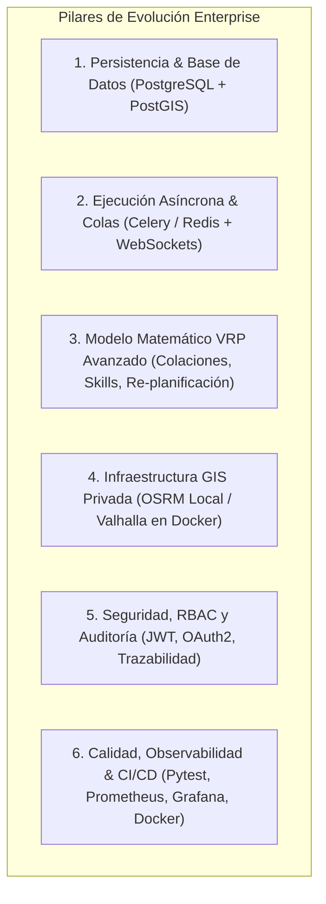
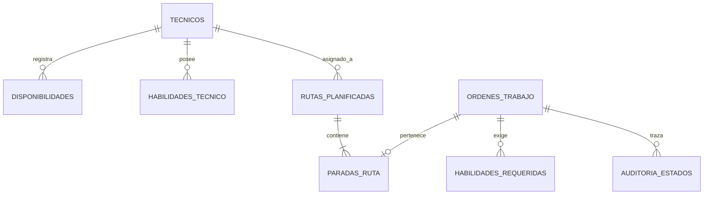
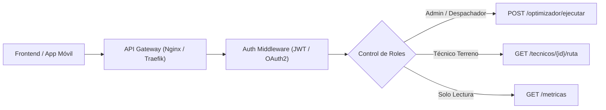

# Auditoría de Ingeniería y Roadmap de Evolución: Optimizador VRP Enterprise

**Proyecto:** Optimizador de Rutas y Despacho en Terreno  
**Documento:** Evaluación de Madurez Tecnológica y Áreas de Mejora para Producción Corporativa  
**Fecha:** 26 de Agosto, 2026  
**Clasificación:** Arquitectura de Software, Computación Cuantitativa y DevOps  

---

## 1. Diagnóstico de Madurez Tecnológica Actual

El proyecto actual cuenta con un **núcleo algorítmico sólido** (Google OR-Tools VRPTW con ventanas horarias, tiempos de servicio diferenciados, corrección vial $1.30\times$ y balance de flota) y una **interfaz gráfica funcional**. 

Sin embargo, para calificar como un **Sistema de TI Corporativo (Enterprise-Grade)** capaz de operar en telecomunicaciones, logística o servicios básicos con cientos de técnicos diarios, se identifican 6 pilares críticos de evolución:



---

## 2. Áreas de Mejora Detalladas

---

### Pilar 1: Arquitectura de Persistencia y Modelado de Datos (Data Layer)

#### Estado Actual:
- Base de datos 100% en memoria RAM (`DB_TECNICOS`, `DB_ORDENES`).
- Si el proceso de Python se reinicia o se despliega en múltiples instancias (Kubernetes), se pierde el estado y se generan inconsistencias.

#### Mejoras Requeridas:
1. **Migración a Base de Datos Relacional y Espacial:**
   - Implementar **PostgreSQL 16** con la extensión **PostGIS**.
   - Almacenar coordenadas como geometrías espaciales nativas (`Point(lon, lat, 4326)`), permitiendo consultas espaciales ultrarrápidas (ej. *"Buscar OTs en un radio de 5 km de una cuadrilla"* mediante índices `GIST`).
2. **Capa ORM con Migraciones Automatizadas:**
   - Adoptar **SQLAlchemy 2.0** o **SQLModel** con **Alembic** para versionamiento de esquemas de base de datos.
3. **Auditoría de Historial de Estados (Event Sourcing / Change Log):**
   - Tabla `historial_estados_ot` para registrar quién asignó, reasignó o canceló una OT, a qué hora y con qué motivo.



---

### Pilar 2: Ejecución Asíncrona, Colas de Tareas y Tiempo Real

#### Estado Actual:
- `POST /api/optimizador/ejecutar` se ejecuta sincrónicamente en el hilo de la petición HTTP. Si el solver tarda 15 o 30 segundos, bloquea la conexión y puede causar timeouts en navegadores o reverse proxies (Nginx/Cloudflare).

#### Mejoras Requeridas:
1. **Cola de Tareas Distribuida (Celery / RQ / ARQ + Redis):**
   - El endpoint `POST /api/optimizador/ejecutar` debe retornar inmediatamente un `job_id` (`HTTP 202 Accepted`):
     ```json
     {
       "job_id": "a5e2f7b1-9c3d-4e8a-8a12-1b2c3d4e5f6a",
       "status": "QUEUED",
       "check_status_url": "/api/jobs/a5e2f7b1-9c3d-4e8a-8a12-1b2c3d4e5f6a"
     }
     ```
   - Un worker independiente de Celery ejecuta la optimización de OR-Tools en segundo plano sin congelar la API.
2. **Actualizaciones en Tiempo Real vía WebSockets o Server-Sent Events (SSE):**
   - El frontend y las aplicaciones móviles de los técnicos reciben el progreso del solver y la hoja de ruta generada en vivo sin necesidad de refrescar la página.

---

### Pilar 3: Modelo Matemático VRP y Restricciones Operativas del Mundo Real

#### Estado Actual:
- Resuelve VRPTW con ventanas horarias, capacidades y tiempos de servicio fijos.

#### Mejoras Requeridas en el Solver de OR-Tools:

1. **Gestión de Horario de Colación / Almuerzo Obligatorio (Leyes Laborales):**
   - En Chile (Art. 34 del Código del Trabajo), el descanso de colación (30 a 60 min) es obligatorio entre las 12:30 y las 14:30.
   - **Solución Técnica:** Usar `time_dimension.SetBreakIntervalsOfVehicle` para insertar automáticamente una pausa no laborable sin asignar paradas durante ese lapso.

2. **Ruteo Basado en Habilidades y Certificaciones (Skill-Based Routing):**
   - No todos los técnicos pueden realizar cualquier trabajo (ej. *Fusión de Fibra Óptica*, *Trabajo en Altura*, *Instalación Trifásica*, *Certificación SEC*).
   - **Solución Técnica:** Matriz de compatibilidad booleana y penalización/bloqueo de nodo con `routing.VehicleVar(index).RemoveValues(incompatibles)`.

3. **Re-planificación Dinámica ante Imprevistos en Terreno (Intra-day Replanning):**
   - Si un técnico se retrasa 40 minutos por tráfico o un cliente no se encuentra en el domicilio:
   - **Solución Técnica:** Re-optimización en caliente fijando las paradas ya completadas (`routing.SetFixedSequenceOfInitialVariables`) y re-enrutando únicamente las OTs pendientes del día.

4. **Bases de Partida y Fin Asimétricas (Open VRP / Multi-Depot):**
   - Técnicos que inician la jornada desde su domicilio particular y finalizan en la bodega central para descarga de materiales o devolución de herramientas.

5. **Inventario y Repuestos en Vehículo (Multi-Dimensional Capacity):**
   - Cada técnico lleva un stock limitado (ej. 5 módems ONT, 3 decodificadores, 200m de cable). El solver debe verificar que la suma de materiales de la ruta no exceda el inventario de la camioneta.

---

### Pilar 4: Infraestructura GIS y Motor de Ruteo Privado

#### Estado Actual:
- Depende del servidor público `router.project-osrm.org` y del endpoint público de Nominatim, sujetos a cuotas de uso (1 req/seg) y sin acuerdo de nivel de servicio (SLA).

#### Mejoras Requeridas:
1. **Despliegue de Servidor OSRM / Valhalla Privado en Docker:**
   - Descargar el archivo `.osm.pbf` oficial de Chile (Geofabrik) y compilar la red vial en un contenedor Docker local.
   - **Beneficios:**
     - Tiempos de respuesta de matriz de distancias: de **~800 ms a < 15 ms**.
     - Capacidad para resolver matrices de **500x500 nodos sin restricciones de red**.
     - Costo cero por llamadas a APIs comerciales.
2. **Perfiles de Tráfico Histórico y Horas Punta:**
   - Incorporar matrices de velocidad variable según horario (ej. Santiago en hora punta 07:30-09:30 vs 11:00-13:00).

---

### Pilar 5: Seguridad, Autenticación y Gobernanza (Enterprise Security)



#### Mejoras Requeridas:
1. **Autenticación JWT / OAuth2 con PKCE:**
   - Reemplazar el acceso abierto por autenticación segura con tokens de acceso y de refresco.
2. **Control de Acceso Basado en Roles (RBAC):**
   - **Super Administrador:** Modifica parámetros algorítmicos y configuraciones globales.
   - **Despachador:** Ejecuta optimizaciones, reasigna cuadrillas y confirma hojas de ruta.
   - **Técnico en Terreno:** Solo puede ver su propia ruta asignada y reportar avances (`iniciar_visita`, `finalizar_ot`).
3. **Protección contra Abusos (Rate Limiting & CORS Estricto):**
   - Limitar peticiones por IP/Token con `slowapi` para prevenir ataques de denegación de servicio (DoS).
4. **Almacenamiento Seguro de Credenciales:**
   - Gestión de secretos mediante variables de entorno encriptadas (`pydantic-settings`, AWS Secrets Manager o HashiCorp Vault).

---

### Pilar 6: DevOps, Observabilidad, Calidad y Pruebas (SRE & QA)

#### Mejoras Requeridas:
1. **Suite de Pruebas Automatizadas (Pytest & Benchmark):**
   - **Pruebas Unitarias:** Cobertura de funciones geométricas, sanitización de direcciones y extracción de comunas (> 90% coverage).
   - **Pruebas de Estrés y Escalabilidad:** Simulación del solver con 50 técnicos y 500 OTs midiendo tiempo de convergencia y memoria RAM.
   - **Pruebas de Invarianza Matemática:** Validar que ninguna solución viole ventanas de tiempo ni capacidades máximas.
2. **Contenerización y Orquestación:**
   - Crear `Dockerfile` multi-stage optimizado y `docker-compose.yml` para levantar en 1 comando:
     - Servicio `backend` (FastAPI).
     - Servicio `worker` (Celery).
     - Servicio `broker` (Redis).
     - Servicio `database` (PostgreSQL + PostGIS).
     - Servicio `routing-engine` (OSRM Chile).
3. **Observabilidad y Telemetría:**
   - **Logs Estructurados:** Formato JSON con correlación `request_id`.
   - **Métricas Prometheus:** Duración del solver, tasa de descarte de OTs, latencia de geocodificación.
   - **Trazas y Alertas:** Integración con Sentry / Grafana / OpenTelemetry para monitoreo proactivo de fallos en producción.

---

## 3. Matriz de Priorización y Roadmap de Implementación

| Fase | Iniciativa | Impacto Operativo | Complejidad Técnica | Plazo Estimado |
| :---: | :--- | :---: | :---: | :---: |
| **Fase 1 (Corto Plazo)** | **1. Base de Datos PostgreSQL + SQLAlchemy** (Persistencia real). | 🔴 Crítico | Media | 1 - 2 semanas |
| **Fase 1 (Corto Plazo)** | **2. Ejecución Asíncrona con Celery + Redis** (Evitar bloqueo HTTP). | 🔴 Crítico | Media | 1 semana |
| **Fase 1 (Corto Plazo)** | **3. Contenedores Docker + Docker Compose** (Despliegue estándar). | 🟡 Alto | Baja | 2 - 3 días |
| **Fase 2 (Medio Plazo)** | **4. Horario de Colación y Skills en OR-Tools** (Cumplimiento legal y operativo). | 🔴 Crítico | Media | 1 - 2 semanas |
| **Fase 2 (Medio Plazo)** | **5. Servidor OSRM / Geocodificador Privado** (Independencia y velocidad). | 🟡 Alto | Media | 1 semana |
| **Fase 2 (Medio Plazo)** | **6. Autenticación JWT y Roles RBAC** (Seguridad corporativa). | 🟡 Alto | Media | 1 semana |
| **Fase 3 (Largo Plazo)** | **7. Re-planificación Dinámica Intra-día** (Ajuste ante retrasos en vivo). | 🟢 Diferenciador | Alta | 2 - 3 semanas |
| **Fase 3 (Largo Plazo)** | **8. App Móvil PWA para Técnicos** (Check-in GPS, firma digital y cierre de OT). | 🟢 Diferenciador | Alta | 3 - 4 semanas |

---

## 4. Conclusión Ejecutiva

El sistema actual posee un **motor matemático funcional y una arquitectura desacoplada**. 

Siguiendo este plan de modernización, la plataforma pasará de ser un prototipo de alto rendimiento a convertirse en una **suite de despacho y logística vehicular de clase mundial**, lista para soportar operaciones de misión crítica con alta disponibilidad, trazabilidad y cumplimiento normativo.
