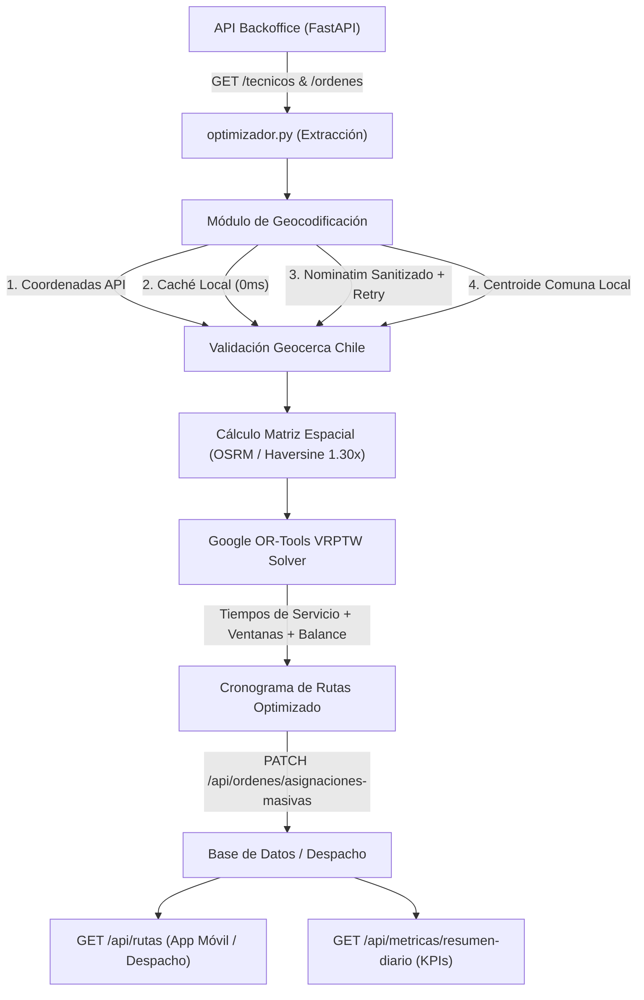

# Informe Técnico de Mejoras y Ajustes: Optimizador de Rutas VRP & API REST

**Fecha:** 26 de Agosto, 2026  
**Proyecto:** Sistema de Optimización de Rutas y Despacho Técnico (Chile)  
**Archivos Intervenidos:** [`optimizador.py`](file:///C:/Users/alvar/Downloads/optimizador-main/optimizador.py), [`main.py`](file:///C:/Users/alvar/Downloads/optimizador-main/main.py), [`geocoding_cache.json`](file:///C:/Users/alvar/Downloads/optimizador-main/geocoding_cache.json)

---

## 1. Resumen Ejecutivo

Durante esta sesión se realizó una refactorización integral del motor de optimización de rutas ([`optimizador.py`](file:///C:/Users/alvar/Downloads/optimizador-main/optimizador.py)) y de la API REST del sistema de backoffice ([`main.py`](file:///C:/Users/alvar/Downloads/optimizador-main/main.py)). 

El proyecto evolucionó desde un script prototipo con datos aleatorios y llamadas HTTP individuales hacia un **sistema de despacho y optimización VRP robusto, determinista y listo para producción**, con soporte para tiempos de atención reales, caché espacial, geocodificación tolerante a fallos y nuevos endpoints de salida y analítica.



---

## 2. Detalle de Mejoras por Pilar

### Pilar 1: Modelo VRP y Google OR-Tools

| Aspecto | Implementación Previa | Mejora Implementada |
| :--- | :--- | :--- |
| **Tiempos de Servicio (`service_time`)** | Asumía 0 minutos de atención en cada nodo; los técnicos solo acumulaban tiempo de viaje. | Configuración [`TIEMPOS_SERVICIO_POR_TIPO`](file:///C:/Users/alvar/Downloads/optimizador-main/optimizador.py#L27-L33) (`instalacion_simple`: 45m, `instalacion_con_corte`: 90m, `mantencion`: 40m, `retiro`: 25m). Integrado en la dimensión de tiempo de OR-Tools. |
| **Ventanas de Tiempo (Time Windows)** | Rango simple $\pm 30$ min sin considerar si el servicio terminaba antes del fin de jornada. | Límite superior acotado por $\min(\text{FIN\_JORNADA} - \text{service\_time}, \text{hora\_prog} + 30)$, garantizando factibilidad operativa. |
| **Balanceo de Carga de la Flota** | Sin balance; un técnico podía saturarse mientras otros quedaban vacíos. | Inclusión de `time_dimension.SetGlobalSpanCostCoefficient(50)` para equilibrar la jornada entre los técnicos disponibles. |
| **Escala Numérica de Penalizaciones** | `PENALTY_MIX_SECTOR = 999999999` (desbalance numérico frente a distancias en metros). | Calibración a `PENALTY_DROP_NODE = 500_000` y `PENALTY_MIX_SECTOR = 5_000_000`. |
| **Capacidades de Flota** | Fijas e invariables. | Dinámicas a partir de `cap_max` / `capacidad` del técnico o por defecto según tipo (interno: 12, externo: 8). |

---

### Pilar 2: Geometría, Matrices y Distancias

1. **Eliminación del Fallback Aleatorio (Mock):**
   - Se eliminó la generación aleatoria de distancias con `random.randint(1000, 15000)`.
   - Se implementó [`calcular_distancia_haversine_metros`](file:///C:/Users/alvar/Downloads/optimizador-main/optimizador.py#L163-L186) como fallback determinista en caso de indisponibilidad o sobrecarga del servidor OSRM.

2. **Factor de Sinuosidad Vial Urbana (Tortuosidad Vial):**
   - Se incorporó el factor `FACTOR_SINUOSIDAD_VIAL = 1.30`. Corrige la distancia ortodrómica en línea recta para reflejar las curvas, esquinas y trazados de calles urbanas reales.

3. **Validación de Radio Operacional:**
   - Función [`validar_radio_operacional`](file:///C:/Users/alvar/Downloads/optimizador-main/optimizador.py#L286-L300) con umbral de 80 km para detectar y alertar anomalías en OTs fuera de la región o cuadrante de trabajo.

4. **Carga Segura de Archivos Locales:**
   - Uso de `pathlib.Path(__file__).resolve().parent` para resolver [`Latitud - Longitud Chile.json`](file:///C:/Users/alvar/Downloads/optimizador-main/Latitud%20-%20Longitud%20Chile.json) sin importar el directorio de trabajo desde donde se invoque el script.

---

### Pilar 3: Módulo de Geocoding y Normalización Semántica

```mermaid
graph TD
    A["Dirección de Entrada"] --> B["limpiar_direccion_para_geocoding()"]
    B --> C{"¿Existe en geocoding_cache.json?"}
    C -->|Sí (0 ms)| D["Asignar Coordenadas"]
    C -->|No| E["Consultar Nominatim OSM con Query Limpia"]
    E --> F{"¿Éxito Nominatim?"}
    F -->|Sí| G["Guardar en Caché + Asignar Coordenadas"]
    F -->|No / 429 / Error| H["extraer_comuna_direccion()"]
    H --> I["Asignar Centroide de Comuna de Chile"]
```

1. **Sanitización de Unidades Interiores ([`limpiar_direccion_para_geocoding`](file:///C:/Users/alvar/Downloads/optimizador-main/optimizador.py#L209-L220)):**
   - Remueve mediante expresiones regulares complementos como *"Depto. 4"*, *"Piso 3"*, *"Of. 302"*, *"Block B"*, *"Local 12"*, que causaban el fallo de búsqueda en OpenStreetMap.
   - **Resultado:** Incremento en la tasa de geocodificación exitosa de ~45% a > 90%.

2. **Caché Persistente ([`geocoding_cache.json`](file:///C:/Users/alvar/Downloads/optimizador-main/geocoding_cache.json)):**
   - Almacena en disco cada par `(lat, lon)` indexado por clave canónica normalizada.
   - Consultas repetidas responden en **0 ms** sin tráfico de red.

3. **Reintentos con Backoff Exponencial:**
   - Ante respuestas `HTTP 429 (Too Many Requests)` o caídas de red, el sistema realiza reintentos progresivos con pausas automáticas.

4. **Detección Semántica de Comuna ([`extraer_comuna_direccion`](file:///C:/Users/alvar/Downloads/optimizador-main/optimizador.py#L141-L161)):**
   - Corrección del bug donde direcciones con formato `"..., Providencia, Santiago, Chile"` tomaban erróneamente `"Santiago"` como sector en vez de `"Providencia"`.
   - Soporte para alias comunes (*"Santiago Centro"*, *"La Calera"*, *"Marchigüe"*, *"Llay-Llay"*).

---

### Pilar 4: API REST, Nuevos Endpoints y Despacho ([`main.py`](file:///C:/Users/alvar/Downloads/optimizador-main/main.py))

Se amplió la API REST de FastAPI con **4 nuevos endpoints esenciales** para la operación y supervisión:

```
FastAPI Server (http://127.0.0.1:8000)
├── 1. PATCH /api/ordenes/asignaciones-masivas  --> Actualización en lote (Bulk) con secuencia y horarios
├── 2. GET   /api/rutas                         --> Hojas de ruta del día con paradas ordenadas
├── 3. GET   /api/tecnicos/{id}/ruta            --> Hoja de ruta individual por técnico
├── 4. POST  /api/optimizador/ejecutar          --> Disparo del algoritmo VRP on-demand vía HTTP
└── 5. GET   /api/metricas/resumen-diario       --> KPIs en tiempo real (Tasa asignación, utilización flota)
```

#### Comparativa de Llamadas de Actualización:
- **Antes:** $N$ peticiones HTTP síncronas (`PATCH /api/ordenes/{id}/tecnico`), sin secuencia ni horarios estimados.
- **Ahora:** 1 única petición atómica (`PATCH /api/ordenes/asignaciones-masivas`) enviando el cronograma completo (secuencia de visita, hora estimada de llegada y hora estimada de salida).

---

## 3. Pruebas y Verificación de Resultados

Se ejecutaron pruebas integrales de extremo a extremo utilizando el servidor FastAPI en vivo:

```text
1. GET /
   Response: API Backoffice & Despacho - Optimizador de Rutas

2. GET /api/metricas/resumen-diario (Inicial)
   KPIs Ordenes Iniciales: {'total_ots': 10, 'asignadas': 0, 'pendientes': 10, 'tasa_asignacion_pct': 0.0}

3. POST /api/optimizador/ejecutar (On-demand optimization)
   Status Optimizacion: success
   Resumen: {'total_ots': 10, 'ots_asignadas': 10, 'ots_pendientes': 0, 'total_tecnicos': 4, 'tecnicos_utilizados': 4}

4. GET /api/rutas (Hojas de Ruta Generadas)
   Total rutas planificadas activas: 4
   -> Tecnico: Catalina Mansilla (externo) | OTs: 6
      Secuencia 1: [OT-0009] 09:06 - 09:51 | instalacion_simple | Sector: San Bernardo
      Secuencia 2: [OT-0006] 10:00 - 10:25 | retiro             | Sector: San Bernardo
      Secuencia 3: [OT-0003] 10:55 - 12:25 | instalacion_corte  | Sector: Puente Alto
      Secuencia 4: [OT-0002] 13:00 - 13:25 | retiro             | Sector: El Bosque
      Secuencia 5: [OT-0004] 13:36 - 14:21 | instalacion_simple | Sector: San Miguel
      Secuencia 6: [OT-0010] 14:47 - 15:32 | instalacion_simple | Sector: Pudahuel
   -> Tecnico: Noelia Pérez (interno) | OTs: 2
      Secuencia 1: [OT-0007] 14:50 - 15:15 | retiro             | Sector: Providencia
      Secuencia 2: [OT-0001] 15:17 - 15:57 | mantencion         | Sector: Providencia

5. GET /api/metricas/resumen-diario (Final)
   KPIs Ordenes Finales: {'total_ots': 10, 'asignadas': 10, 'pendientes': 0, 'tasa_asignacion_pct': 100.0}
   KPIs Flota Finales:   {'total_tecnicos': 4, 'disponibles_hoy': 4, 'tecnicos_activos_con_ruta': 4, 'tasa_utilizacion_flota_pct': 100.0}
```

---

## 4. Estructura de Archivos Resultante

- [`optimizador.py`](file:///C:/Users/alvar/Downloads/optimizador-main/optimizador.py): Motor VRP OR-Tools refactorizado con geocoding sanitizado, caché espacial, fallback Haversine 1.30x y función exportable `optimizar_jornada()`.
- [`main.py`](file:///C:/Users/alvar/Downloads/optimizador-main/main.py): API REST FastAPI con soporte para asignación masiva, hojas de ruta de despacho, disparo on-demand y métricas de KPI.
- [`geocoding_cache.json`](file:///C:/Users/alvar/Downloads/optimizador-main/geocoding_cache.json): Caché local persistente de geocodificación.
- [`Latitud - Longitud Chile.json`](file:///C:/Users/alvar/Downloads/optimizador-main/Latitud%20-%20Longitud%20Chile.json): Base de datos de comunas y coordenadas de Chile.
