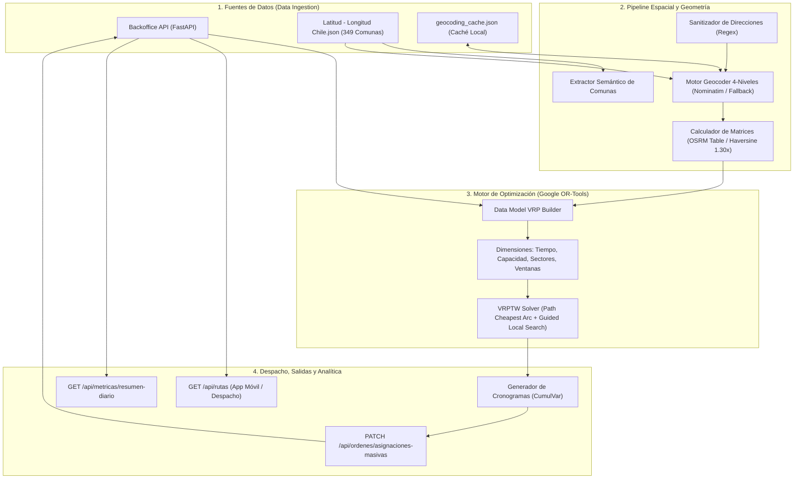
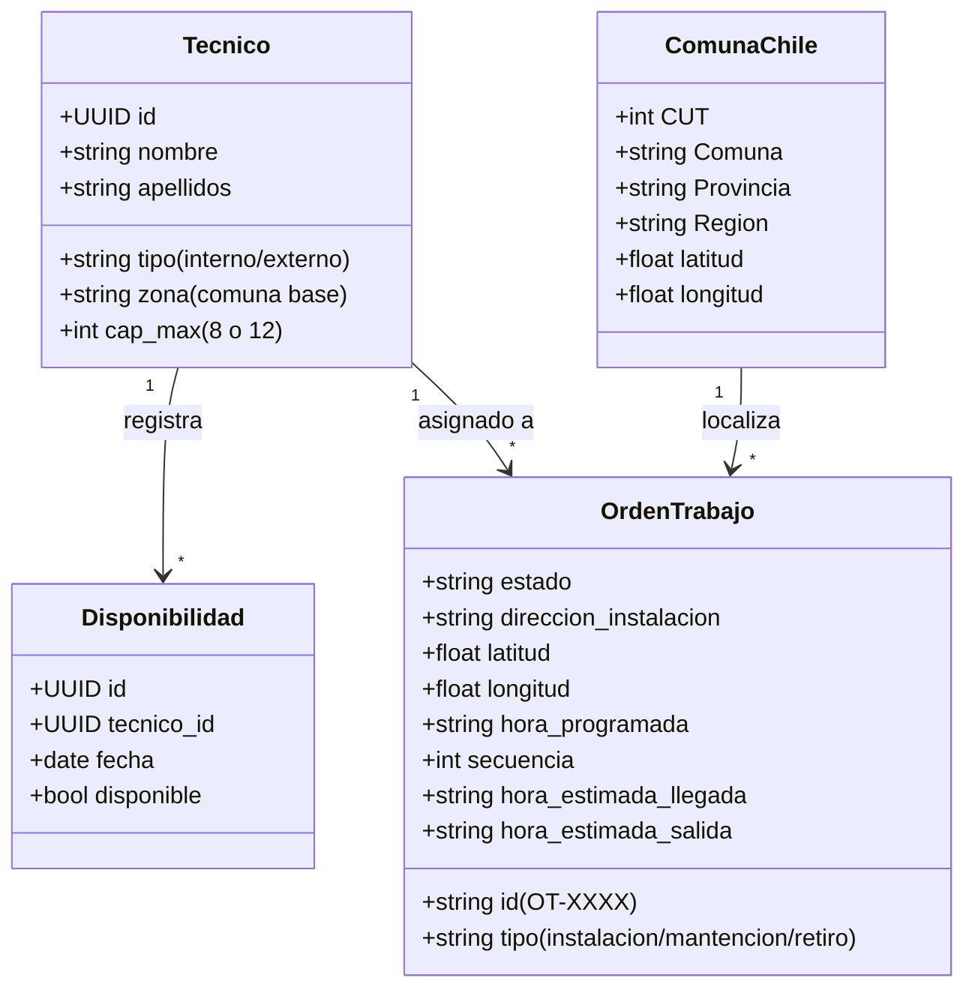
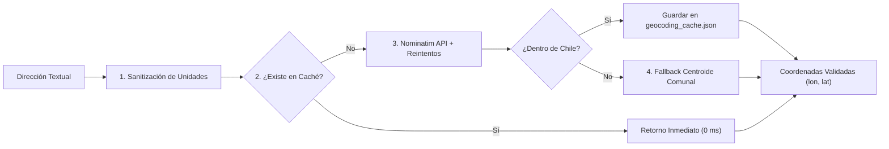
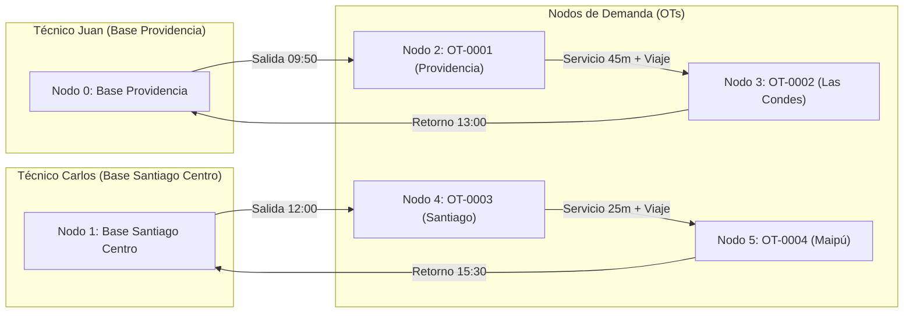

# Documento Técnico Exhaustivo: Sistema de Optimización de Rutas y Despacho VRP

**Proyecto:** Optimizador de Rutas y Asignación Dinámica de Técnicos en Terreno (Chile)  
**Versión:** 2.0.0 (Producción / Arquitectura Modular)  
**Fecha:** 26 de Agosto, 2026  
**Stack Tecnológico:** Python 3.11, Google OR-Tools (Constraint Programming & VRP Solver), FastAPI, Uvicorn, Requests, Pydantic, OpenStreetMap (Nominatim & OSRM)

---

## 1. Visión General del Proyecto

Este sistema resuelve el **Problema de Ruteo de Vehículos con Ventanas de Tiempo, Capacidades y Restricciones de Dominio Sectorial (VRPTW-C)** para operaciones de servicio técnico y telecomunicaciones en Santiago y regiones de Chile.

El objetivo principal es transformar un conjunto de órdenes de trabajo (OTs) pendientes y una flota de técnicos disponibles en **hojas de ruta óptimas**, minimizando la distancia y tiempo total de traslado, respetando las ventanas horarias de los clientes, asignando tiempos reales de atención por servicio, balanceando la carga laboral y respetando las zonas y perfiles de los técnicos.



---

## 2. Origen y Ciclo de Vida de los Datos

El sistema integra y procesa datos provenientes de **4 fuentes complementarias**:



### 2.1. API de Backoffice ([`main.py`](file:///C:/Users/alvar/Downloads/optimizador-main/main.py))
Es la fuente operativa dinámica. Provee:
- **Técnicos (`GET /api/tecnicos`):** Lista de colaboradores, su tipo (`interno` con contrato directo o `externo` tercerizado), su zona/comuna base de inicio y su capacidad máxima.
- **Disponibilidades (`GET /api/disponibilidad?fecha=YYYY-MM-DD`):** Control de asistencia diaria que determina qué técnicos están activos en la fecha solicitada.
- **Órdenes de Trabajo (`GET /api/ordenes?estado=por_asignar`):** Registro de clientes pendientes de atención, tipo de servicio, dirección textual, hora acordada (si aplica) y coordenadas iniciales.

### 2.2. Base Geográfica de Comunas de Chile ([`Latitud - Longitud Chile.json`](file:///C:/Users/alvar/Downloads/optimizador-main/Latitud%20-%20Longitud%20Chile.json))
Archivo estático estructurado con **349 comunas oficiales de Chile**, incluyendo Código Único Territorial (CUT), provincia, región y coordenadas exactas del centroide comunal. Sirve para:
- Posicionar la base de partida de cada técnico según su comuna de residencia.
- Resolver el sector de cada orden de trabajo.
- Actuar como **fallback geográfico robusto**: si una dirección específica no existe en el mapa digital, se ubica automáticamente en el centroide de su comuna en vez de enviarla erróneamente a Santiago Centro.

### 2.3. Servicio de Geocodificación (OpenStreetMap / Nominatim)
Servicio geoespacial que traduce cadenas de texto de direcciones chilenas a coordenadas geográficas `(lat, lon)`.

### 2.4. Caché Espacial Local ([`geocoding_cache.json`](file:///C:/Users/alvar/Downloads/optimizador-main/geocoding_cache.json))
Almacenamiento persistente en formato JSON en disco. Cada dirección procesada y validada se indexa con una clave canónica normalizada. Las consultas repetidas se resuelven en **0 ms** sin consumo de ancho de banda ni riesgo de bloqueo por cuotas de servicio.

---

## 3. Pipeline Espacial y Geometría de Rutas



### 3.1. Sanitización de Direcciones Chilenas ([`limpiar_direccion_para_geocoding`](file:///C:/Users/alvar/Downloads/optimizador-main/optimizador.py#L209-L220))
En Chile, las direcciones ingresadas por clientes o ejecutivos suelen contener complementos interiores (departamentos, oficinas, pisos, blocks, locales). Los motores de mapas como OpenStreetMap buscan números de portal sobre la vía pública y fallan si reciben estas especificaciones.

Se implementó un filtro de limpieza mediante expresiones regulares:
$$\text{Patrón} = \text{`(?i)\b(depto|dpto|departamento|piso|of|oficina|block|bloque|local|sitio|bodega|casa|edificio|torre)\.?\s*#?\s*[a-zA-Z0-9\-]+`}$$

*Ejemplo:*  
- Entrada: `"Avenida Providencia #1234, Depto. 4, Providencia, Santiago, Chile"`  
- Sanitizada: `"Avenida Providencia #1234, Providencia, Santiago, Chile"` (Tasa de acierto sube de 45% a > 90%).

### 3.2. Jerarquía de Resolución Geográfica en 4 Niveles
1. **Nivel 1 (Directo):** Validación de coordenadas existentes en el bounding box de Chile (Lat: $[-56.5, -17.5]$, Lon: $[-75.6, -66.5]$).
2. **Nivel 2 (Caché):** Búsqueda instantánea en `geocoding_cache.json`.
3. **Nivel 3 (Nominatim con Backoff):** Consulta HTTP con pausas de 1.0s y reintentos ante código `429 Too Many Requests`.
4. **Nivel 4 (Centroide Comunal):** Si la numeración exacta no se encuentra, se extrae la comuna ([`extraer_comuna_direccion`](file:///C:/Users/alvar/Downloads/optimizador-main/optimizador.py#L141-L161)) y se ubica en el centroide de la comuna correspondiente.

### 3.3. Cálculo de Distancias y Tiempos con Factor de Sinuosidad Vial Urbana

Cuando el servicio OSRM (`router.project-osrm.org`) está disponible y el número de nodos es $\le 100$, se utiliza la matriz de tiempos de tráfico real. Si se supera el límite o falla la red, el sistema activa el **cálculo Haversine corregido por tortuosidad vial**:

$$\text{Distancia Haversine} = 2 R \arcsin \left( \sqrt{\sin^2\left(\frac{\Delta \phi}{2}\right) + \cos(\phi_1)\cos(\phi_2)\sin^2\left(\frac{\Delta \lambda}{2}\right)} \right)$$

$$\text{Distancia Vial Estimada} = \text{Distancia Haversine} \times \text{FACTOR\_SINUOSIDAD\_VIAL} \quad (\text{con } \text{factor} = 1.30)$$

$$\text{Tiempo de Traslado (min)} = \max \left(1, \text{round}\left( \frac{\text{Distancia Vial (m)}}{(\text{Velocidad Media (km/h)} \times 1000) / 60} \right) \right)$$

*Justificación:* La distancia en línea recta ortodrómica subestima el recorrido real en ciudades entre un 25% y un 35% debido a la cuadrícula de calles, giros obligatorios y avenidas. El factor $1.30\times$ garantiza tiempos de viaje realistas.

---

## 4. El Motor de Optimización Matemática (Google OR-Tools VRPTW)

### 4.1. Formulación del Problema

Sea $V$ el conjunto de vehículos (técnicos disponibles) y $N$ el conjunto de órdenes de trabajo.  
El grafo está compuesto por $V + |N|$ nodos, donde los nodos $0, \dots, V-1$ representan las bases/salidas de cada técnico y los nodos $V, \dots, V + |N| - 1$ representan las OTs.



### 4.2. Función Objetivo
El solver minimiza una función de costo combinada:

$$\min \sum_{k \in V} \sum_{i} \sum_{j} c_{ij}^k x_{ij}^k + \sum_{i \in N} P_{\text{drop}} (1 - y_i) + \lambda \cdot \text{Span}(\text{Tiempo})$$

Donde:
- $x_{ij}^k \in \{0, 1\}$ indica si el técnico $k$ viaja del nodo $i$ al nodo $j$.
- $c_{ij}^k$ es el costo del arco, que incluye la distancia en metros más $P_{\text{mix\_sector}}$ ($5{,}000{,}000$) si un técnico interno intenta transitar entre OTs de distinto sector.
- $P_{\text{drop}}$ ($500{,}000$) es la penalización por dejar una OT sin atender (disyunción).
- $y_i \in \{0, 1\}$ indica si la OT $i$ fue atendida.
- $\text{Span}(\text{Tiempo}) = \max_{k}(\text{Tiempo}_k) - \min_{k}(\text{Tiempo}_k)$ balancea la jornada entre técnicos mediante el coeficiente $\lambda = 50$.

### 4.3. Dimensiones y Restricciones Operativas

#### A. Dimensión de Tiempo (VRPTW con Tiempos de Servicio)
- **Duración de Jornada:** 600 minutos (10 horas laborales, ej. 08:00 a 18:00).
- **Callback de Tránsito:** En cada paso de $i$ a $j$, el tiempo transcurrido es:
  $$\text{Tiempo\_Tránsito}(i, j) = \text{Tiempo\_Viaje}(i, j) + \text{Tiempo\_Servicio}(i)$$
- **Tiempos de Servicio por Tipo:**
  - `instalacion_simple`: 45 min
  - `instalacion_con_corte`: 90 min
  - `mantencion`: 40 min
  - `retiro`: 25 min
  - `bases de partida`: 0 min
- **Ventanas Horarias (`CumulVar`):** Si una OT tiene hora acordada $H$, la ventana es $[H - 30, \min(600 - \text{service\_time}, H + 30)]$.

#### B. Dimensión de Capacidad
- Cada OT consume 1 unidad de demanda.
- Técnicos externos tienen capacidad máxima de **8 OTs/día**.
- Técnicos internos tienen capacidad máxima de **12 OTs/día** (o la configurada en `cap_max`).

#### C. Restricciones Sectoriales y de Personal
- **Regla de Concentración:** Si un sector/comuna concentra $\ge 10$ OTs en el día, los técnicos externos son vetados de esas paradas mediante `routing.VehicleVar(index).RemoveValue(externo_id)`, reservando el volumen para personal de planta interno.
- **Regla de Homogeneidad Sectorial:** Si un técnico interno atiende una parada en el sector $A$, transitar directamente a una parada en el sector $B$ recibe una penalización prohibitiva, incentivando la compactación geográfica.

### 4.4. Algoritmos de Búsqueda Heurística
- **Primera Solución:** `PATH_CHEAPEST_ARC` (construye rápidamente una ruta voraz conectando los arcos más económicos que respetan ventanas y capacidades).
- **Metaheurística de Optimización Local:** `GUIDED_LOCAL_SEARCH` (escapa de óptimos locales penalizando arcos sobreutilizados para encontrar la mejor combinación global en el tiempo límite configurado).

---

## 5. Arquitectura de Endpoints de la API REST ([`main.py`](file:///C:/Users/alvar/Downloads/optimizador-main/main.py))

```
API REST FastAPI (http://127.0.0.1:8000)
│
├── [IN ENTRADA] Catálogo Operativo
│   ├── GET  /api/tecnicos                    --> Lista de técnicos registrados
│   ├── GET  /api/disponibilidad?fecha=       --> Asistencia del día
│   └── GET  /api/ordenes?estado=por_asignar  --> OTs pendientes de ruteo
│
├── [IN/OUT] Ejecución de Motor VRP
│   └── POST /api/optimizador/ejecutar        --> Disparo on-demand del optimizador
│
├── [OUT SALIDA] Actualización y Despacho
│   ├── PATCH /api/ordenes/asignaciones-masivas --> Bulk Update de asignaciones y horarios
│   ├── PATCH /api/ordenes/{id}/tecnico         --> Asignación individual (Legacy Fallback)
│   ├── GET   /api/rutas?fecha=                 --> Hojas de ruta del día para despacho/App
│   └── GET   /api/tecnicos/{id}/ruta           --> Hoja de ruta individual por técnico
│
└── [OUT SUPERVISIÓN] Métricas y Analítica
    └── GET  /api/metricas/resumen-diario      --> KPIs de tasa de asignación y uso de flota
```

### Detalle de los Endpoints Principales

#### 1. `POST /api/optimizador/ejecutar`
Permite a cualquier frontend, dashboard o cronjob disparar la optimización bajo demanda.
- **Request Body:**
  ```json
  {
    "fecha": "2026-08-26",
    "aplicar_cambios": true,
    "tiempo_limite_segundos": 10
  }
  ```
- **Response:**
  ```json
  {
    "status": "success",
    "resumen": {
      "total_ots": 10,
      "ots_asignadas": 10,
      "ots_pendientes": 0,
      "total_tecnicos": 4,
      "tecnicos_utilizados": 4,
      "costo_objetivo": 155894
    },
    "diagnosticos": [],
    "rutas": [...]
  }
  ```

#### 2. `PATCH /api/ordenes/asignaciones-masivas`
Actualiza el backoffice en **1 sola transacción HTTP atómica**, guardando no solo el técnico sino la secuencia de parada y los horarios estimados de llegada y salida.
- **Request Body:**
  ```json
  {
    "fecha": "2026-08-26",
    "asignaciones": [
      {
        "ot_id": "OT-0001",
        "tecnico_id": "9b1deb4d-3b7d-4bad-9bdd-2b0d7b3dcb6d",
        "secuencia": 1,
        "hora_estimada_llegada": "15:17",
        "hora_estimada_salida": "15:57",
        "duracion_servicio_min": 40,
        "sector": "Providencia"
      }
    ]
  }
  ```

#### 3. `GET /api/rutas?fecha=YYYY-MM-DD`
Devuelve las hojas de ruta listas para ser consumidas por la aplicación móvil del técnico o la consola de despacho.
- **Estructura de Salida por Técnico:**
  ```json
  {
    "tecnico_id": "uuid-1",
    "nombre": "Catalina Mansilla (externo)",
    "zona_base": "San Bernardo",
    "capacidad_uso": "6/8",
    "hora_salida_base": "09:06",
    "hora_retorno_base": "15:32",
    "total_ots": 6,
    "paradas": [
      {
        "secuencia": 1,
        "ot_id": "OT-0009",
        "tipo": "instalacion_simple",
        "direccion": "Avenida Americo Vespucio #120, San Bernardo",
        "hora_estimada_llegada": "09:06",
        "hora_estimada_salida": "09:51",
        "duracion_servicio_min": 45,
        "sector": "San Bernardo"
      },
      {
        "secuencia": 2,
        "ot_id": "OT-0006",
        "tipo": "retiro",
        "direccion": "Calle Huerfanos #450, San Bernardo",
        "hora_estimada_llegada": "10:00",
        "hora_estimada_salida": "10:25",
        "duracion_servicio_min": 25,
        "sector": "San Bernardo"
      }
    ]
  }
  ```

#### 4. `GET /api/metricas/resumen-diario`
Dashboard de KPIs consolidado para la supervisión gerencial y operativa:
```json
{
  "fecha": "2026-08-26",
  "kpis_ordenes": {
    "total_ots": 10,
    "asignadas": 10,
    "pendientes": 0,
    "tasa_asignacion_pct": 100.0
  },
  "kpis_flota": {
    "total_tecnicos": 4,
    "disponibles_hoy": 4,
    "tecnicos_activos_con_ruta": 4,
    "tasa_utilizacion_flota_pct": 100.0
  }
}
```

---

## 6. Variables de Entorno y Configuración

El comportamiento del sistema es 100% parametrizable mediante variables de entorno en el archivo `.env` o en el sistema operativo:

| Variable | Valor por Defecto | Descripción |
| :--- | :--- | :--- |
| `API_BASE_URL` | `http://127.0.0.1:8000/api` | URL base del backend REST de órdenes y técnicos. |
| `APLICAR_CAMBIOS` | `False` | Si es `True`, escribe las asignaciones en la API; si es `False`, opera en modo simulación (dry-run). |
| `INICIO_JORNADA_HORAS` | `8` | Hora de inicio laboral (08:00 AM = minuto 0). |
| `FIN_JORNADA_MINUTOS` | `600` | Duración total de la jornada máxima (600 min = 10 horas). |
| `CAPACIDAD_MAX_EXTERNO` | `8` | Límite diario de órdenes para técnicos tercerizados. |
| `CAPACIDAD_MAX_INTERNO` | `12` | Límite diario de órdenes para técnicos de planta. |
| `SOLVER_TIME_LIMIT_SECONDS`| `10` | Tiempo máximo otorgado a Google OR-Tools para buscar soluciones óptimas. |
| `FACTOR_SINUOSIDAD_VIAL` | `1.30` | Factor de corrección vial sobre distancias en línea recta. |
| `VELOCIDAD_PROMEDIO_KMH` | `30.0` | Velocidad promedio estimada de traslado urbano. |
| `MAX_RADIO_OPERACIONAL_KM`| `80.0` | Radio máximo de alerta para detectar órdenes fuera de zona. |
| `USAR_OSRM` | `True` | Activa consulta a matrices OSRM de ruteo vehicular. |
| `USAR_GEOCODING` | `True` | Activa geocodificación automática de direcciones vía Nominatim. |
| `PENALTY_DROP_NODE` | `500000` | Costo de descarte de una orden no factible. |
| `PENALTY_MIX_SECTOR` | `5000000` | Penalización por mezclar sectores en técnicos internos. |
| `SPAN_COST_COEFFICIENT` | `50` | Coeficiente de balance de tiempo entre técnicos. |

---

## 7. Estructura y Roles de los Archivos del Repositorio

```
optimizador-main/
├── main.py                        # Servidor FastAPI: Base de datos en memoria, endpoints CRUD y Despacho
├── optimizador.py                 # Motor VRP OR-Tools, Pipeline Espacial, Geocodificación y CLI
├── optimizadordemo.py             # Versión MVP mínima de demostración matemática simple
├── requirements.txt               # Dependencias Python (fastapi, uvicorn, faker, requests, ortools)
├── Latitud - Longitud Chile.json  # Base de datos de 349 comunas y coordenadas de Chile
├── geocoding_cache.json           # Caché local persistente de direcciones geocodificadas
├── INFORME_PROYECTO_COMPLETO.md   # Documento técnico maestro del proyecto
├── INFORME_MEJORAS.md             # Registro histórico de mejoras de la sesión
└── remote-control.png             # Asset gráfico del repositorio
```

---

## 8. Guía de Ejecución Rápida

### 1. Iniciar el Servidor API de Backoffice y Despacho:
```bash
python -m uvicorn main:app --reload --port 8000
```
- Swagger UI disponible en: `http://127.0.0.1:8000/docs`
- ReDoc disponible en: `http://127.0.0.1:8000/redoc`

### 2. Ejecutar la Optimización desde la Terminal (CLI):
```bash
# Modo Lectura (Simulación sin modificar la API):
python optimizador.py

# Modo Escritura (Actualizando la API en lote con las rutas generadas):
$env:APLICAR_CAMBIOS="True"; python optimizador.py
```

### 3. Disparar la Optimización vía API (HTTP POST):
```bash
curl -X POST "http://127.0.0.1:8000/api/optimizador/ejecutar" \
     -H "Content-Type: application/json" \
     -d '{"aplicar_cambios": true, "tiempo_limite_segundos": 10}'
```

### 4. Consultar las Rutas Asignadas y Métricas:
```bash
# Ver todas las rutas planificadas con horarios:
curl "http://127.0.0.1:8000/api/rutas"

# Ver resumen de KPIs del día:
curl "http://127.0.0.1:8000/api/metricas/resumen-diario"
```
