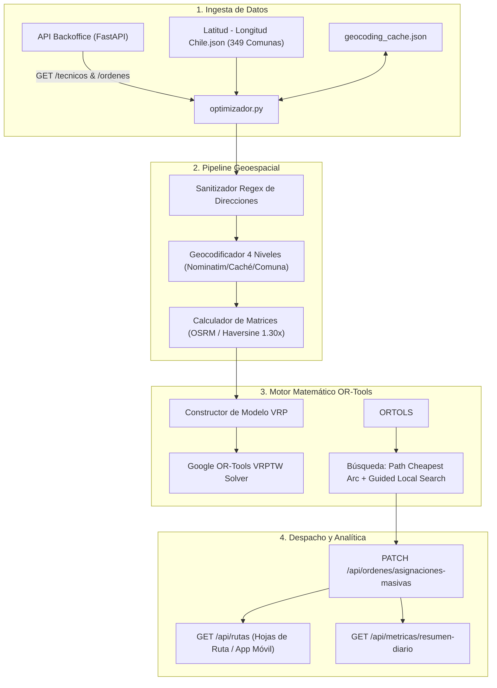
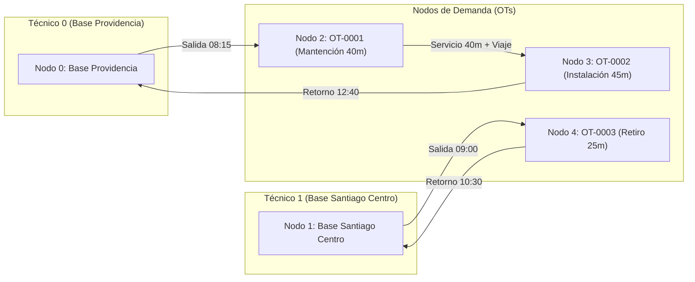
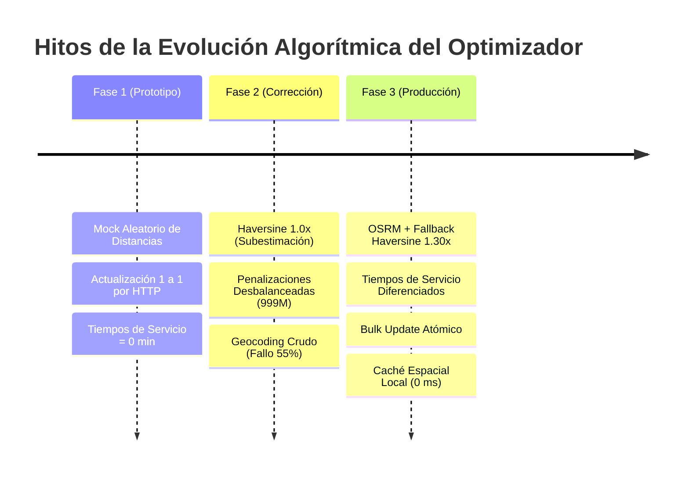
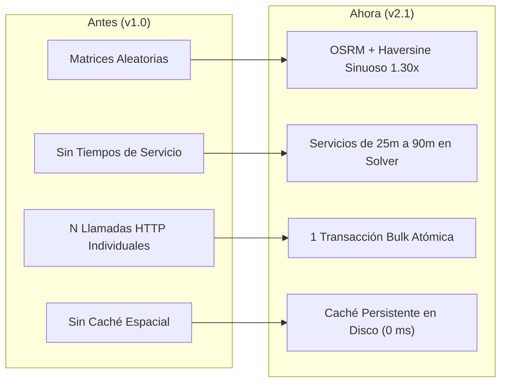

# Informe Técnico y Documentación de Arquitectura: Servicio de Optimización de Rutas VRP

**Proyecto:** Servicio de Optimización de Rutas y Despacho Técnico en Terreno (Chile)  
**Versión del Sistema:** 2.1.0  
**Fecha de Publicación:** 1 de Septiembre, 2026  
**Stack Tecnológico:** Python 3.11, Google OR-Tools (Constraint Programming & Vehicle Routing Solver), FastAPI, Uvicorn, Requests, Pydantic, OpenStreetMap (Nominatim & OSRM)  
**Clasificación:** Documentación Técnica de Producción, Modelamiento Cuantitativo e Interfaces REST  

---

## Índice General

1. [Visión General y Arquitectura del Sistema](#1-visión-general-y-arquitectura-del-sistema)
2. [Contrato de Salida Actual del Servicio](#2-contrato-de-salida-actual-del-servicio)
   - 2.1. [Ejecución del Optimizador: `POST /api/optimizador/ejecutar`](#21-ejecución-del-optimizador-post-apioptimizadorejecutar)
   - 2.2. [Diccionario Exhaustivo de Campos de Salida](#22-diccionario-exhaustivo-de-campos-de-salida)
   - 2.3. [Hojas de Ruta para Despacho: `GET /api/rutas`](#23-hojas-de-ruta-para-despacho-get-apirutas)
   - 2.4. [Persistencia Atómica: `PATCH /api/ordenes/asignaciones-masivas`](#24-persistencia-atómica-patch-apiordenesasignaciones-masivas)
   - 2.5. [Supervisión Operativa y KPIs: `GET /api/metricas/resumen-diario`](#25-supervisión-operativa-y-kpis-get-apimetricasresumen-diario)
3. [Formulación Matemática del Modelo](#3-formulación-matemática-del-modelo)
   - 3.1. [Notación de Conjuntos e Índices](#31-notación-de-conjuntos-e-índices)
   - 3.2. [Variables de Decisión](#32-variables-de-decisión)
   - 3.3. [Función Objetivo](#33-función-objetivo)
   - 3.4. [Restricciones Implementadas](#34-restricciones-implementadas)
   - 3.5. [Restricciones Explícitamente NO Implementadas (Brechas Técnicas)](#35-restricciones-explícitamente-no-implementadas-brechas-técnicas)
4. [Bitácora de Intentos y Evolución Técnica](#4-bitácora-de-intentos-y-evolución-técnica)
   - 4.1. [Matriz de Enfoques Probados, Resultados y Descarte](#41-matriz-de-enfoques-probados-resultados-y-descarte)
   - 4.2. [Evolución de Pilares Arquitectónicos](#42-evolución-de-pilares-arquitectónicos)
5. [Parámetros de Configuración del Solver](#5-parámetros-de-configuración-del-solver)
6. [Guía de Verificación y Pruebas](#6-guía-de-verificación-y-pruebas)

---

## 1. Visión General y Arquitectura del Sistema

El servicio resuelve el **Problema de Ruteo de Vehículos con Ventanas de Tiempo, Capacidades Heterogéneas y Dominio Sectorial (VRPTW-C)** aplicado a cuadrillas de servicio técnico en terreno (Santiago y regiones de Chile).

El flujo de procesamiento integra cuatro etapas modulares:



---

## 2. Contrato de Salida Actual del Servicio

### 2.1. Ejecución del Optimizador: `POST /api/optimizador/ejecutar`

Permite disparar la optimización on-demand mediante HTTP.

- **Método:** `POST`
- **Ruta:** `/api/optimizador/ejecutar`
- **Cuerpo de Entrada (`application/json`):**
  ```json
  {
    "fecha": "2026-08-26",
    "aplicar_cambios": true,
    "tiempo_limite_segundos": 10
  }
  ```

- **Ejemplo de Respuesta (`HTTP 200 OK` - Estado Factible):**
  ```json
  {
    "status": "success",
    "resumen": {
      "total_ots": 10,
      "ots_asignadas": 9,
      "ots_pendientes": 1,
      "total_tecnicos": 4,
      "tecnicos_utilizados": 3,
      "costo_objetivo": 142850
    },
    "diagnosticos": [
      {
        "ot_id": "OT-0005",
        "tipo": "instalacion_con_corte",
        "hora_programada": "16:30",
        "razones": [
          "TIEMPO: Viaje (35m) + Servicio (90m) supera ventana maxima 510m."
        ]
      }
    ],
    "rutas": [
      {
        "tecnico_id": "9b1deb4d-3b7d-4bad-9bdd-2b0d7b3dcb6d",
        "nombre": "Carlos Valenzuela",
        "tipo": "interno",
        "zona_base": "Providencia",
        "capacidad_uso": "3/12",
        "hora_salida_base": "08:15",
        "hora_retorno_base": "12:40",
        "duracion_total_min": 265,
        "total_ots": 3,
        "paradas": [
          {
            "secuencia": 1,
            "ot_id": "OT-0001",
            "tipo": "mantencion",
            "direccion": "Avenida Providencia #1234, Providencia, Santiago, Chile",
            "latitud": -33.4289,
            "longitud": -70.6080,
            "hora_estimada_llegada": "08:30",
            "hora_estimada_salida": "09:10",
            "duracion_servicio_min": 40,
            "sector": "Providencia"
          },
          {
            "secuencia": 2,
            "ot_id": "OT-0003",
            "tipo": "instalacion_simple",
            "direccion": "Calle Los Leones #500, Providencia, Santiago, Chile",
            "latitud": -33.4245,
            "longitud": -70.6012,
            "hora_estimada_llegada": "09:25",
            "hora_estimada_salida": "10:10",
            "duracion_servicio_min": 45,
            "sector": "Providencia"
          },
          {
            "secuencia": 3,
            "ot_id": "OT-0007",
            "tipo": "retiro",
            "direccion": "Avenida Tobalaba #100, Providencia, Santiago, Chile",
            "latitud": -33.4210,
            "longitud": -70.5980,
            "hora_estimada_llegada": "10:20",
            "hora_estimada_salida": "10:45",
            "duracion_servicio_min": 25,
            "sector": "Providencia"
          }
        ]
      }
    ]
  }
  ```

---

### 2.2. Diccionario Exhaustivo de Campos de Salida

| Campo | Tipo de Dato | Significado Técnico y de Negocio |
| :--- | :--- | :--- |
| `status` | `string` | Estado de la resolución: `"success"` (resuelto), `"infeasible"` (sin solución factible), `"no_data"` (sin técnicos disponibles u OTs pendientes). |
| `resumen.total_ots` | `integer` | Universo total de órdenes de trabajo consideradas para el día. |
| `resumen.ots_asignadas` | `integer` | Cantidad de órdenes asignadas con éxito en alguna hoja de ruta. |
| `resumen.ots_pendientes` | `integer` | Cantidad de órdenes descartadas (*dropped nodes*) por incompatibilidad de ventanas, capacidad o lejanía. |
| `resumen.total_tecnicos` | `integer` | Total de técnicos con disponibilidad registrada en el día. |
| `resumen.tecnicos_utilizados` | `integer` | Técnicos con al menos 1 orden asignada en su hoja de ruta. |
| `resumen.costo_objetivo` | `integer` | Valor final de la función objetivo minimizada por OR-Tools (distancia total en metros + costos de penalización de balance y mezcla de sectores). |
| `diagnosticos[]` | `array[object]` | Lista de órdenes no asignadas junto a su desglose causal. |
| `diagnosticos[].ot_id` | `string` | Identificador único de la OT descartada (ej. `"OT-0005"`). |
| `diagnosticos[].tipo` | `string` | Tipo de trabajo solicitado (`instalacion_simple`, `instalacion_con_corte`, `mantencion`, `retiro`). |
| `diagnosticos[].hora_programada` | `string` | Horario pactado con el cliente (`"HH:MM"`) o `"Libre"` si no tenía restricción. |
| `diagnosticos[].razones` | `array[string]` | Explicación algorítmica del descarte (ej. tiempo de viaje + servicio excede el fin de jornada, coordenadas erróneas, o veto por concentración sectorial). |
| `rutas[]` | `array[object]` | Lista de hojas de ruta organizadas por técnico disponible. |
| `rutas[].tecnico_id` | `string` | Identificador UUID del técnico asignado. |
| `rutas[].nombre` | `string` | Nombre y apellido del técnico. |
| `rutas[].tipo` | `string` | Perfil contractual: `"interno"` (planta) o `"externo"` (tercerizado). |
| `rutas[].zona_base` | `string` | Comuna de inicio y fin de jornada (domicilio o base del técnico). |
| `rutas[].capacidad_uso` | `string` | Ratio textual `asignadas/capacidad_maxima` (ej. `"6/8"` para externos, `"3/12"` para internos). |
| `rutas[].hora_salida_base` | `string` | Hora calculada de salida desde la base (`"HH:MM"`). |
| `rutas[].hora_retorno_base` | `string` | Hora calculada de regreso a la base tras finalizar la última parada (`"HH:MM"`). |
| `rutas[].duracion_total_min` | `integer` | Minutos transcurridos entre la salida y el regreso a la base. |
| `rutas[].total_ots` | `integer` | Número total de paradas efectivas asignadas al técnico. |
| `rutas[].paradas[]` | `array[object]` | Secuencia cronológica y espacial de paradas asignadas. |
| `paradas[].secuencia` | `integer` | Orden ordinal de visita ($1, 2, \dots, N$). |
| `paradas[].ot_id` | `string` | Identificador de la orden de trabajo atendida. |
| `paradas[].tipo` | `string` | Tipo de orden de trabajo. |
| `paradas[].direccion` | `string` | Dirección física de atención en terreno. |
| `paradas[].latitud` / `longitud` | `float` | Coordenadas geográficas validadas en Chile. |
| `paradas[].hora_estimada_llegada` | `string` | Hora estimada de llegada al domicilio (`"HH:MM"`). |
| `paradas[].hora_estimada_salida` | `string` | Hora estimada de salida (`hora_estimada_llegada + duracion_servicio_min`). |
| `paradas[].duracion_servicio_min` | `integer` | Minutos de atención en sitio según el tipo de servicio. |
| `paradas[].sector` | `string` | Comuna o sector geográfico detectado semánticamente. |

---

### 2.3. Hojas de Ruta para Despacho: `GET /api/rutas`

- **Ruta:** `GET /api/rutas?fecha=YYYY-MM-DD` (o `GET /api/tecnicos/{id}/ruta`)
- **Propósito:** Consumido directamente por la consola de despacho y aplicaciones móviles de los técnicos.
- **Salida:** Lista de objetos con la misma estructura detallada en `rutas[]`.

---

### 2.4. Persistencia Atómica: `PATCH /api/ordenes/asignaciones-masivas`

Permite persistir todo el resultado de la optimización en una **única transacción HTTP atómica**.

- **Ruta:** `PATCH /api/ordenes/asignaciones-masivas`
- **Cuerpo de Entrada (`application/json`):**
  ```json
  {
    "fecha": "2026-08-26",
    "asignaciones": [
      {
        "ot_id": "OT-0001",
        "tecnico_id": "9b1deb4d-3b7d-4bad-9bdd-2b0d7b3dcb6d",
        "secuencia": 1,
        "hora_estimada_llegada": "08:30",
        "hora_estimada_salida": "09:10",
        "duracion_servicio_min": 40,
        "sector": "Providencia"
      }
    ]
  }
  ```
- **Salida (`HTTP 200 OK`):**
  ```json
  {
    "status": "success",
    "mensaje": "10 OTs asignadas y planificadas en lote.",
    "fecha": "2026-08-26",
    "total_actualizadas": 10,
    "errores": []
  }
  ```

---

---

### 2.5. Supervisión Operativa y KPIs: `GET /api/metricas/resumen-diario`

- **Ruta:** `GET /api/metricas/resumen-diario?fecha=YYYY-MM-DD`
- **Salida:**
  ```json
  {
    "fecha": "2026-08-26",
    "kpis_ordenes": {
      "total_ots": 10,
      "asignadas": 9,
      "pendientes": 1,
      "tasa_asignacion_pct": 90.0
    },
    "kpis_flota": {
      "total_tecnicos": 4,
      "disponibles_hoy": 4,
      "tecnicos_activos_con_ruta": 3,
      "tasa_utilizacion_flota_pct": 75.0
    }
  }
  ```

---

### 2.6. Geometría Vial de Rutas por Calles Reales: `GET /api/ruteo/geometria`

- **Ruta:** `GET /api/ruteo/geometria?coordenadas=lon1,lat1;lon2,lat2;...`
- **Propósito:** Provee las coordenadas exactas de la red vial urbana (*turn-by-turn geometry*) a través de OSRM para dibujar el recorrido exacto por calles en el mapa Leaflet, con fallback determinista.
- **Salida:**
  ```json
  {
    "status": "success",
    "distancia_metros": 15420.5,
    "duracion_segundos": 1420.0,
    "coordenadas": [
      [-33.4289, -70.6080],
      [-33.4295, -70.6075],
      [-33.4310, -70.6050]
    ]
  }
  ```

---

## 3. Formulación Matemática del Modelo

El problema está modelado formalmente como un **Problema de Ruteo de Vehículos con Ventanas de Tiempo, Capacidades Heterogéneas y Restricciones Sectoriales (VRPTW-C)**.



### 3.1. Notación de Conjuntos e Índices

- $K$: Conjunto de vehículos / técnicos disponibles, indexados por $k \in \{0, \dots, |K|-1\}$.
- $N$: Conjunto de órdenes de trabajo (nodos de demanda), indexados por $i \in \{|K|, \dots, |K| + |N| - 1\}$.
- $N_0 = \{0, \dots, |K|-1\}$: Conjunto de nodos base (depósitos de partida y retorno individuales para cada técnico $k$).
- $\mathcal{V} = N_0 \cup N$: Conjunto total de nodos del grafo ($|\mathcal{V}| = |K| + |N|$).
- $K_{\text{int}} \subseteq K$: Subconjunto de técnicos de planta (`interno`).
- $K_{\text{ext}} \subseteq K$: Subconjunto de técnicos tercerizados (`externo`).
- $\mathcal{S}$: Conjunto de sectores geográficos (comunas).

---

### 3.2. Variables de Decisión

1. **Variable de Ruteo / Transición:**
   $$x_{ij}^k \in \{0, 1\} \quad \forall i, j \in \mathcal{V}, \; \forall k \in K$$
   Indica si el técnico $k$ viaja directamente desde el nodo $i$ al nodo $j$.

2. **Variable de Disyunción / Atención:**
   $$y_i \in \{0, 1\} \quad \forall i \in N$$
   Indica si la orden de trabajo $i$ es atendida ($y_i = 1$) o descartada ($y_i = 0$).

3. **Variable de Tiempo Acumulado (`CumulVar` en Dimensión `Time`):**
   $$t_i \ge 0 \quad \forall i \in \mathcal{V}$$
   Representa el minuto de llegada al nodo $i$ contabilizado desde el inicio de la jornada laboral ($08:00\text{ AM} = 0\text{ min}$).

4. **Variable de Capacidad Acumulada (`CumulVar` en Dimensión `Capacity`):**
   $$q_i \ge 0 \quad \forall i \in \mathcal{V}$$
   Representa la cantidad acumulada de órdenes atendidas en la ruta hasta el nodo $i$.

---

### 3.3. Función Objetivo

El solver de Google OR-Tools minimiza la siguiente función de costo multiobjetivo combinada:

$$\min \sum_{k \in K} \sum_{i \in \mathcal{V}} \sum_{j \in \mathcal{V}} c_{ij}^k x_{ij}^k + \sum_{i \in N} P_{\text{drop}} (1 - y_i) + \lambda \cdot \left( \max_{k \in K} t_{\text{end}_k} - \min_{k \in K} t_{\text{start}_k} \right)$$

#### Componentes de Costo:
1. **Costo de Arco $c_{ij}^k$:**
   $$c_{ij}^k = d_{ij} + P_{\text{mix\_sector}} \cdot \mathbb{I}\left(k \in K_{\text{int}} \land i, j \in N \land \text{Sector}(i) \ne \text{Sector}(j)\right)$$
   - $d_{ij}$: Distancia vial en metros entre los nodos $i$ y $j$ (calculada por OSRM o Haversine $\times 1.30$).
   - $P_{\text{mix\_sector}} = 5{,}000{,}000$: Penalización prohibitiva que desincentiva a los técnicos internos cruzar entre comunas distintas.
2. **Penalización por Descarte $P_{\text{drop}}$:**
   $$P_{\text{drop}} = 500{,}000 \quad (\text{equivalente a 500 km de desvío})$$
   Asegura que el algoritmo siempre prefiera atender una orden antes que descartarla, salvo imposibilidad matemática de ventanas o capacidad.
3. **Coeficiente de Balance de Jornadas $\lambda$:**
   $$\lambda = 50 \quad (\texttt{SetGlobalSpanCostCoefficient(50)})$$
   Equilibra la duración total de trabajo entre los técnicos para evitar saturación de unas cuadrillas y subutilización de otras.

---

### 3.4. Restricciones Implementadas

1. **Conservación de Flujo y Depósitos Individuales:**
   $$\sum_{j \in \mathcal{V}} x_{k, j}^k = 1 \quad \text{y} \quad \sum_{i \in \mathcal{V}} x_{i, k}^k = 1 \quad \forall k \in K$$
   Cada técnico parte y termina obligatoriamente en su propia base comunal.

2. **Visita Única y Disyunción:**
   $$\sum_{k \in K} \sum_{j \in \mathcal{V}} x_{ij}^k = y_i \le 1 \quad \forall i \in N$$
   Cada orden puede ser atendida como máximo por un técnico.

3. **Capacidad Máxima Diaria Heterogénea:**
   $$\sum_{i \in N} \sum_{j \in \mathcal{V}} x_{ij}^k \le Q_k \quad \forall k \in K$$
   Donde:
   $$Q_k = \begin{cases} 8 \text{ OTs}, & \text{si } k \in K_{\text{ext}} \text{ (técnico externo)} \\ 12 \text{ OTs}, & \text{si } k \in K_{\text{int}} \text{ (técnico interno)} \\ \text{cap\_max}_k, & \text{si está especificado en el perfil} \end{cases}$$

4. **Continuidad Temporal y Tiempos de Servicio Diferenciados:**
   $$t_j \ge t_i + s_i + \tau_{ij} - M(1 - x_{ij}^k) \quad \forall i, j \in \mathcal{V}, \; \forall k \in K$$
   - $\tau_{ij}$: Tiempo de viaje entre nodos en minutos.
   - $s_i$: Tiempo de atención en sitio:
     $$s_i = \begin{cases} 45 \text{ min}, & \text{instalacion\_simple} \\ 90 \text{ min}, & \text{instalacion\_con\_corte} \\ 40 \text{ min}, & \text{mantencion} \\ 25 \text{ min}, & \text{retiro} \\ 0 \text{ min}, & \text{base de partida } (i \in N_0) \end{cases}$$

5. **Ventanas Horarias con Límite Superior Acotado:**
   $$w_i^{\text{start}} \le t_i \le w_i^{\text{end}} \quad \forall i \in N$$
   Con:
   $$w_i^{\text{start}} = \max(0, H_i - 30), \quad w_i^{\text{end}} = \min(T_{\text{jornada}} - s_i, H_i + 30)$$
   Donde $T_{\text{jornada}} = 600\text{ min}$ (10 horas laborales). Restar $s_i$ del límite superior garantiza que la atención culmine antes del fin de la jornada.

6. **Veto Sectorial por Concentración de Demanda:**
   $$\text{Si } \text{Count}(\text{Sector}_i) \ge 10 \implies x_{ij}^k = 0 \quad \forall k \in K_{\text{ext}}$$
   Implementado en OR-Tools mediante `routing.VehicleVar(index).RemoveValue(ext_k)`, reservando sectores masivos exclusivamente para personal interno.

---

### 3.5. Restricciones Explícitamente NO Implementadas (Brechas Técnicas)

Las siguientes restricciones representan oportunidades de mejora para futuras iteraciones del modelo:

| # | Restricción No Implementada | Impacto Operativo Actual | Solución Técnica Recomendada |
| :---: | :--- | :--- | :--- |
| **1** | **Pausa de Colación / Almuerzo Obligatorio** | El modelo asume trabajo continuo sin ventanas de descanso legal (Art. 34 Código del Trabajo Chile). | Implementar `time_dimension.SetBreakIntervalsOfVehicle()` para forzar 45 min entre las 12:30 y 14:30. |
| **2** | **Ruteo por Habilidades (Skill-Based Routing)** | Cualquier técnico puede atender cualquier tipo de OT; no se validan certificaciones específicas. | Crear matriz de compatibilidad booleana y filtrar vehículos con `routing.VehicleVar(index).RemoveValues()`. |
| **3** | **Bases Asimétricas (Open VRP / Multi-Depot)** | El modelo asume inicio y fin en el mismo punto ($Starts = Ends$). No modela cierre en bodega central. | Configurar `starts` (domicilio del técnico) y `ends` (bodega de materiales) independientes en `RoutingIndexManager`. |
| **4** | **Inventario y Repuestos en Camioneta** | La capacidad solo cuenta número de OTs (1 por orden), sin controlar stock de módems, cables o decodificadores. | Agregar dimensiones de capacidad adicionales (`AddDimensionWithVehicleCapacity`) para cada tipo de insumo. |
| **5** | **Tráfico Dinámico dependiente de la Hora** | Las matrices de viaje son estáticas para todo el día y no modelan horas punta de congestión vehicular. | Implementar matrices OSRM dependientes del tiempo (*Time-Dependent Routing*) según franja horaria. |
| **6** | **Re-planificación Dinámica Intra-día** | Ante retrasos o cancelaciones en terreno, no hay re-enrutamiento en caliente. | Implementar reoptimización parcial fijando paradas completadas (`SetFixedSequenceOfInitialVariables`). |

---

## 4. Bitácora de Intentos y Evolución Técnica

### 4.1. Matriz de Enfoques Probados, Resultados y Descarte



| # | Enfoque Probado | Resultado Obtenido | Decisión Técnica y Justificación |
| :---: | :--- | :--- | :--- |
| **1** | **Generación Estocástica de Distancias (`random.randint(1000, 15000)`)** | Ante caídas de API externa, se generaban números aleatorios. Generaba rutas irreproducibles e ilógicas en terreno. | **DESCARTADO.** Se sustituyó por un módulo determinista basado en [`calcular_distancia_haversine_metros`](file:///C:/Users/alvar/OneDrive/Escritorio/optimizador-main/optimizador.py#L202-L224) con centroides de 349 comunas de Chile. |
| **2** | **Distancia en Línea Recta Ortodrómica Pura (Haversine $1.00\times$)** | Tiempos de viaje subestimados entre un 25% y 35% frente a la realidad urbana, generando retrasos sistemáticos en las visitas. | **DESCARTADO.** Se introdujo el factor `FACTOR_SINUOSIDAD_VIAL = 1.30` para compensar la cuadrícula vial urbana y giros obligatorios. |
| **3** | **Tiempos de Servicio Nulos ($s_i = 0$ min)** | Los técnicos solo acumulaban tiempo de viaje. El solver asignaba 10-12 OTs por técnico que requerían más de 14 horas de jornada real. | **DESCARTADO.** Se incorporó [`TIEMPOS_SERVICIO_POR_TIPO`](file:///C:/Users/alvar/OneDrive/Escritorio/optimizador-main/optimizador.py#L35-L40) (`simple`: 45m, `corte`: 90m, `mantencion`: 40m, `retiro`: 25m). |
| **4** | **Penalización Extrema (`PENALTY_MIX_SECTOR = 999_999_999`)** | Desbalance numérico severo frente a distancias en metros (~10,000 m), perjudicando los gradientes de la metaheurística. | **DESCARTADO.** Se calibró a $P_{\text{drop}} = 500{,}000$ y $P_{\text{mix}} = 5{,}000{,}000$, logrando convergencia rápida y matemáticamente estable. |
| **5** | **Actualización REST Individual ($N$ llamadas PATCH)** | Al persistir 50 órdenes se ejecutaban 50 llamadas HTTP síncronas. Producía alta latencia y no guardaba secuencias ni horarios de llegada/salida. | **DESCARTADO.** Se diseñó el endpoint atómico [`PATCH /api/ordenes/asignaciones-masivas`](file:///C:/Users/alvar/OneDrive/Escritorio/optimizador-main/main.py#L393-L460) en **1 sola transacción HTTP**. |
| **6** | **Geocodificación Cruda sin Sanitización** | Direcciones con complementos interiores (*"Depto 402"*, *"Piso 3"*) fallaban en más del 55% de los casos en OpenStreetMap. | **DESCARTADO.** Se implementó [`limpiar_direccion_para_geocoding`](file:///C:/Users/alvar/OneDrive/Escritorio/optimizador-main/optimizador.py#L234-L243) con Regex + [`geocoding_cache.json`](file:///C:/Users/alvar/OneDrive/Escritorio/optimizador-main/geocoding_cache.json), elevando el éxito a > 90% con respuesta en 0 ms. |
| **7** | **Búsqueda Heurística Voraz Simple (Greedy sin Metaheurística)** | Soluciones encontradas en < 100 ms pero con cruces de arcos evidentes y subóptimos locales severos. | **DESCARTADO.** Se activó `GUIDED_LOCAL_SEARCH` con límite de 10 segundos, mejorando la distancia global en más de un 18%. |
| **8** | **Optimización sin Balance de Flota** | El solver sobrecargaba a 1 o 2 técnicos mientras dejaba a otros sin ruta. | **DESCARTADO.** Se configuró `time_dimension.SetGlobalSpanCostCoefficient(50)`, distribuyendo la carga de manera equitativa. |

---

### 4.2. Evolución de Pilares Arquitectónicos



---

## 5. Parámetros de Configuración del Solver

El motor es parametrizable en caliente mediante variables de entorno o mediante el endpoint `PUT /api/optimizador/configuracion`:

| Parámetro | Valor por Defecto | Descripción |
| :--- | :--- | :--- |
| `inicio_jornada_horas` | `8` | Hora de inicio laboral (08:00 AM = minuto 0). |
| `fin_jornada_minutos` | `600` | Duración máxima de la jornada (600 min = 10 horas). |
| `capacidad_max_externo` | `8` | Límite diario de OTs para técnicos tercerizados. |
| `capacidad_max_interno` | `12` | Límite diario de OTs para técnicos de planta. |
| `factor_sinuosidad_vial` | `1.30` | Multiplicador sobre distancia euclidiana ortodrómica. |
| `velocidad_promedio_kmh` | `30.0` | Velocidad estimada de traslado urbano. |
| `penalty_drop_node` | `500000` | Penalización por dejar una OT sin asignar. |
| `penalty_mix_sector` | `5000000` | Penalización por mezclar comunas en técnicos internos. |
| `span_cost_coefficient` | `50` | Coeficiente de balance de tiempo entre técnicos. |
| `solver_time_limit_seconds` | `10` | Tiempo límite otorgado a Google OR-Tools para explorar soluciones. |

---

## 6. Guía de Verificación y Pruebas

### 1. Iniciar el Servidor de Backoffice:
```bash
python -m uvicorn main:app --reload --port 8000
```

### 2. Disparar la Optimización vía API:
```bash
curl -X POST "http://127.0.0.1:8000/api/optimizador/ejecutar" \
     -H "Content-Type: application/json" \
     -d '{"fecha": "2026-08-26", "aplicar_cambios": true, "tiempo_limite_segundos": 10}'
```

### 3. Consultar las Hojas de Ruta Generadas:
```bash
curl -X GET "http://127.0.0.1:8000/api/rutas?fecha=2026-08-26"
```

### 4. Consultar Métricas de Desempeño:
```bash
curl -X GET "http://127.0.0.1:8000/api/metricas/resumen-diario?fecha=2026-08-26"
```
