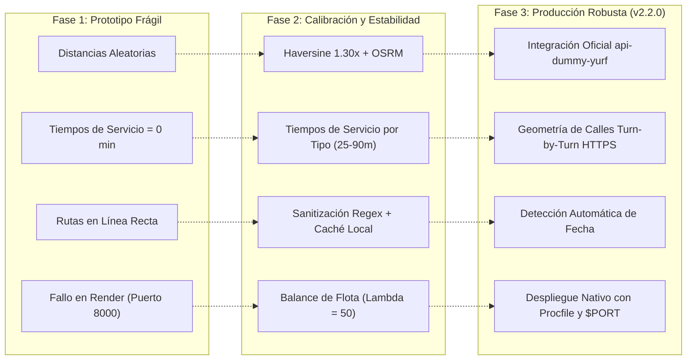

# Informe Técnico y Documentación de Arquitectura: Servicio de Optimización de Rutas VRP

**Proyecto:** Servicio de Optimización de Rutas y Despacho Técnico en Terreno  
**Versión del Sistema:** 2.2.0 (Producción Render & Integración API Dummy)  
**Fecha de Publicación:** 1 de Septiembre, 2026  
**Stack Tecnológico:** Python 3.11, Google OR-Tools (Constraint Programming & Vehicle Routing Solver), FastAPI, Uvicorn, Requests, Leaflet.js, OSRM Driving Service (HTTPS), OpenStreetMap Nominatim  
**Ambiente de Producción:** Render Cloud Web Service (`uvicorn main:app --host 0.0.0.0 --port $PORT`)  
**Fuente de Datos Operativos:** `https://api-dummy-yurf.onrender.com/`  
**Clasificación:** Documentación Técnica de Producción, Modelamiento Matemático Cuantitativo y Bitácora de Evolución  

---

## Índice General

1. [Visión General y Topología de Integración](#1-visión-general-y-topología-de-integración)
2. [Contrato de Salida Actual del Servicio](#2-contrato-de-salida-actual-del-servicio)
   - 2.1. [Ejecución del Optimizador: `POST /api/optimizador/ejecutar`](#21-ejecución-del-optimizador-post-apioptimizadorejecutar)
   - 2.2. [Diccionario Exhaustivo de Campos de Salida](#22-diccionario-exhaustivo-de-campos-de-salida)
   - 2.3. [Hojas de Ruta para Despacho: `GET /api/rutas`](#23-hojas-de-ruta-para-despacho-get-apirutas)
   - 2.4. [Sincronización con API Externa: `PATCH /api/ordenes/{id}/tecnico`](#24-sincronización-con-api-externa-patch-apiordenesidtecnico)
   - 2.5. [Supervisión Operativa y KPIs: `GET /api/metricas/resumen-diario`](#25-supervisión-operativa-y-kpis-get-apimetricasresumen-diario)
   - 2.6. [Geometría Vial por Calles Reales: `GET /api/ruteo/geometria`](#26-geometría-vial-por-calles-reales-get-apiruteogeometria)
3. [Formulación Matemática del Modelo](#3-formulación-matemática-del-modelo)
   - 3.1. [Notación de Conjuntos e Índices](#31-notación-de-conjuntos-e-índices)
   - 3.2. [Variables de Decisión](#32-variables-de-decisión)
   - 3.3. [Función Objetivo Multicriterio](#33-función-objetivo-multicriterio)
   - 3.4. [Restricciones Implementadas](#34-restricciones-implementadas)
   - 3.5. [Restricciones Explícitamente NO Implementadas (Brechas Técnicas y Roadmap)](#35-restricciones-explícitamente-no-implementadas-brechas-técnicas-y-roadmap)
4. [Bitácora de Intentos y Evolución Técnica (13 Hitos)](#4-bitácora-de-intentos-y-evolución-técnica-13-hitos)
   - 4.1. [Matriz Detallada de Enfoques Probados, Resultados y Causa de Descarte](#41-matriz-detallada-de-enfoques-probados-resultados-y-causa-de-descarte)
   - 4.2. [Diagrama de Evolución Arquitectónica](#42-diagrama-de-evolución-arquitectónica)
5. [Parámetros de Configuración del Solver](#5-parámetros-de-configuración-del-solver)
6. [Guía de Verificación, Pruebas y Despliegue en Render](#6-guía-de-verificación-pruebas-y-despliegue-en-render)

---

## 1. Visión General y Topología de Integración

El servicio resuelve el **Problema de Ruteo de Vehículos con Ventanas de Tiempo, Capacidades Heterogéneas y Dominio Sectorial (VRPTW-C)** para cuadrillas técnicas de terreno desplegadas en las regiones de Valparaíso, Metropolitana de Santiago y O'Higgins (Chile).

La arquitectura del sistema desacopla el backoffice operativo, el motor de optimización matemática y la capa de visualización interactiva:

```mermaid
flowchart TD
    subgraph External ["1. Origen de Datos Operativos (API Dummy)"]
        API_EXT["https://api-dummy-yurf.onrender.com"]
        API_EXT -->|GET /api/tecnicos| INGEST
        API_EXT -->|GET /api/ordenes| INGEST
        API_EXT -->|GET /api/disponibilidad| INGEST
    end

    subgraph Core ["2. Servicio Optimizador y Backend Local (FastAPI)"]
        INGEST["Extracción y Detección de Fecha"] --> SANITIZE["Sanitizador de Direcciones"]
        CHILE_GEO["Latitud - Longitud Chile.json (349 Comunas)"] --> RESOLVER["Resolución Geoespacial 4 Niveles"]
        CACHE_GEO["geocoding_cache.json (0 ms)"] <--> RESOLVER
        SANITIZE --> RESOLVER
        RESOLVER --> OSRM_MATRIX["Matriz OSRM / Haversine 1.30x"]
        OSRM_MATRIX --> ORTOOLS["Motor Matemático Google OR-Tools (VRPTW)"]
        ORTOOLS --> DISPATCHER["Generador de Rutas y Diagnósticos"]
    end

    subgraph Sync ["3. Sincronización y Salida"]
        DISPATCHER -->|PATCH /api/ordenes/{id}/tecnico| API_EXT
        DISPATCHER --> MEMORY["Caché de Rutas Planificadas (Memoria)"]
        MEMORY --> ENDPOINT_RUTAS["GET /api/rutas"]
        MEMORY --> ENDPOINT_KPIS["GET /api/metricas/resumen-diario"]
        MEMORY --> UI["Dashboard Web Interactivo (Leaflet + Turn-by-Turn OSRM)"]
    end
```

---

## 2. Contrato de Salida Actual del Servicio

### 2.1. Ejecución del Optimizador: `POST /api/optimizador/ejecutar`

Permite disparar la optimización on-demand tanto desde la interfaz web como mediante integraciones REST directas.

- **Método:** `POST`
- **Ruta:** `/api/optimizador/ejecutar`
- **Cuerpo de Entrada (`application/json`):**
  ```json
  {
    "fecha": "2026-09-02",
    "aplicar_cambios": true,
    "tiempo_limite_segundos": 10
  }
  ```
  *(Nota: Si `"fecha"` se envía como `null` u omitida, el servicio detecta automáticamente la fecha de las órdenes pendientes en la API externa).*

- **Ejemplo de Respuesta (`HTTP 200 OK` - Estado Factible):**
  ```json
  {
    "status": "success",
    "resumen": {
      "total_ots": 18,
      "ots_asignadas": 17,
      "ots_pendientes": 1,
      "total_tecnicos": 11,
      "tecnicos_utilizados": 9,
      "costo_objetivo": 686165
    },
    "diagnosticos": [
      {
        "ot_id": "OT-0018",
        "tipo": "mantencion",
        "hora_programada": "16:30",
        "razones": [
          "TIEMPO: Viaje (185m) + Servicio (40m) supera ventana maxima 600m.",
          "GEOGRAFIA: OT a 129.9 km del centroide de flota (supera radio de 80.0 km)."
        ]
      }
    ],
    "rutas": [
      {
        "tecnico_id": "58fbe522-1791-44b0-97f3-0d97d321ddc6",
        "nombre": "Rafael González Vásquez",
        "tipo": "interno",
        "zona_base": "Valparaíso",
        "base_latitud": -33.0333,
        "base_longitud": -71.6667,
        "capacidad_uso": "3/12",
        "hora_salida_base": "08:15",
        "hora_retorno_base": "12:55",
        "duracion_total_min": 280,
        "total_ots": 3,
        "paradas": [
          {
            "secuencia": 1,
            "ot_id": "OT-0002",
            "tipo": "retiro",
            "direccion": "Condell 1490, Valparaíso",
            "latitud": -33.0480,
            "longitud": -71.6210,
            "hora_estimada_llegada": "08:30",
            "hora_estimada_salida": "08:55",
            "duracion_servicio_min": 25,
            "sector": "Valparaíso"
          },
          {
            "secuencia": 2,
            "ot_id": "OT-0001",
            "tipo": "retiro",
            "direccion": "Errázuriz 563, Viña del Mar",
            "latitud": -33.0250,
            "longitud": -71.5150,
            "hora_estimada_llegada": "09:20",
            "hora_estimada_salida": "09:45",
            "duracion_servicio_min": 25,
            "sector": "Viña Del Mar"
          },
          {
            "secuencia": 3,
            "ot_id": "OT-0004",
            "tipo": "instalacion_simple",
            "direccion": "Avenida Diego Portales 822, Quilpué",
            "latitud": -33.0486,
            "longitud": -71.4428,
            "hora_estimada_llegada": "10:15",
            "hora_estimada_salida": "11:00",
            "duracion_servicio_min": 45,
            "sector": "Quilpué"
          }
        ]
      }
    ]
  }
  ```

---

### 2.2. Diccionario Exhaustivo de Campos de Salida

| Campo | Tipo de Dato | Significado Técnico y Operativo |
| :--- | :--- | :--- |
| `status` | `string` | Estado final del algoritmo: `"success"` (resuelto satisfactoriamente), `"infeasible"` (sin solución matemáticamente factible), `"no_data"` (sin técnicos disponibles u órdenes pendientes en la fecha). |
| `resumen.total_ots` | `integer` | Total de órdenes de trabajo consideradas en el pool de optimización. |
| `resumen.ots_asignadas` | `integer` | Órdenes asignadas y secuenciadas con éxito en alguna hoja de ruta factible. |
| `resumen.ots_pendientes` | `integer` | Órdenes descartadas (*dropped nodes*) por incompatibilidad de ventanas, capacidad o inviabilidad geográfica. |
| `resumen.total_tecnicos` | `integer` | Cantidad total de técnicos con disponibilidad activa en la jornada. |
| `resumen.tecnicos_utilizados` | `integer` | Técnicos con al menos 1 orden asignada en su hoja de ruta. |
| `resumen.costo_objetivo` | `integer` | Valor final de la función objetivo multiobjetivo minimizada por OR-Tools (distancia total en metros ponderada + penalizaciones). |
| `diagnosticos[]` | `array[object]` | Lista de órdenes no asignadas, detallando el motivo causal algorítmico del descarte. |
| `diagnosticos[].ot_id` | `string` | Identificador de la orden descartada (ej. `"OT-0018"`). |
| `diagnosticos[].tipo` | `string` | Tipo de trabajo solicitado (`instalacion_simple`, `instalacion_con_corte`, `mantencion`, `retiro`). |
| `diagnosticos[].hora_programada` | `string` | Ventana horaria solicitada (`"HH:MM"`). |
| `diagnosticos[].razones` | `array[string]` | Explicación técnica del descarte (ej. tiempo de viaje excede jornada, o lejanía del centroide de flota). |
| `rutas[]` | `array[object]` | Lista de hojas de ruta organizadas por técnico operativo. |
| `rutas[].tecnico_id` | `string` | Identificador UUID del técnico asignado en la API externa. |
| `rutas[].nombre` | `string` | Nombre completo del técnico (incluyendo apellidos). |
| `rutas[].tipo` | `string` | Perfil contractual: `"interno"` (planta, cap: 12) o `"externo"` (tercerizado, cap: 8). |
| `rutas[].zona_base` | `string` | Comuna base de inicio y retorno de la cuadrilla (ej: `"Valparaíso"`, `"Santiago"`, `"Rancagua"`). |
| `rutas[].base_latitud` / `longitud` | `float` | Coordenadas geográficas exactas de la base operativa del técnico. |
| `rutas[].capacidad_uso` | `string` | Ratio de utilización respecto a la capacidad permitida (ej: `"3/12"`). |
| `rutas[].hora_salida_base` | `string` | Hora calculada de salida desde la base de operaciones (`"HH:MM"`). |
| `rutas[].hora_retorno_base` | `string` | Hora calculada de retorno a la base tras culminar la última orden (`"HH:MM"`). |
| `rutas[].duracion_total_min` | `integer` | Duración total de la jornada en minutos (viajes + atenciones en terreno). |
| `rutas[].total_ots` | `integer` | Total de paradas efectivas de trabajo asignadas en la ruta. |
| `rutas[].paradas[]` | `array[object]` | Secuencia ordenada de atenciones a realizar en terreno. |
| `paradas[].secuencia` | `integer` | Orden ordinal de visita del técnico ($1, 2, \dots, N$). |
| `paradas[].ot_id` | `string` | Identificador único de la orden atendida. |
| `paradas[].tipo` | `string` | Tipo de intervención técnica. |
| `paradas[].direccion` | `string` | Dirección física de atención (calle, número y comuna). |
| `paradas[].latitud` / `longitud` | `float` | Coordenadas geográficas de la parada. |
| `paradas[].hora_estimada_llegada` | `string` | Hora proyectada de arribo al domicilio (`"HH:MM"`). |
| `paradas[].hora_estimada_salida` | `string` | Hora proyectada de salida (`llegada + duracion_servicio_min`). |
| `paradas[].duracion_servicio_min` | `integer` | Tiempo normado de atención según el tipo de OT. |
| `paradas[].sector` | `string` | Comuna oficial de la parada. |

---

### 2.3. Hojas de Ruta para Despacho: `GET /api/rutas`

- **Ruta:** `GET /api/rutas?fecha=YYYY-MM-DD` (o `GET /api/tecnicos/{id}/ruta`)
- **Propósito:** Consumido por la consola de despacho y aplicaciones móviles de terreno.
- **Salida:** Lista de objetos con la estructura de `rutas[]` descrita anteriormente. Si no se indica fecha o no hay rutas para el día solicitado, retorna la última planificación generada (*default*).

---

### 2.4. Sincronización con API Externa: `PATCH /api/ordenes/{id}/tecnico`

Cuando `aplicar_cambios = true`, el optimizador persiste la asignación de cada orden en la API dummy:

- **Método:** `PATCH`
- **URL Destino:** `https://api-dummy-yurf.onrender.com/api/ordenes/{id}/tecnico`
- **Cuerpo (`application/json`):**
  ```json
  {
    "tecnico_id": "58fbe522-1791-44b0-97f3-0d97d321ddc6"
  }
  ```
- **Respuesta de la API externa (`HTTP 200 OK`):**
  ```json
  {
    "id": "OT-0001",
    "tipo": "retiro",
    "estado": "asignacion_por_confirmar",
    "tecnico_id": "58fbe522-1791-44b0-97f3-0d97d321ddc6",
    "direccion_instalacion": "Errázuriz 563",
    "comuna": "Viña del Mar",
    "region": "Valparaíso",
    "fecha_programada": "2026-09-02",
    "hora_programada": "12:00"
  }
  ```

---

### 2.5. Supervisión Operativa y KPIs: `GET /api/metricas/resumen-diario`

- **Ruta:** `GET /api/metricas/resumen-diario?fecha=YYYY-MM-DD`
- **Propósito:** Expone los indicadores agregados de negocio calculados en tiempo real contra los datos de la API externa.
- **Ejemplo de Salida (`HTTP 200 OK`):**
  ```json
  {
    "fecha": "2026-09-02",
    "kpis_ordenes": {
      "total_ots": 18,
      "asignadas": 17,
      "pendientes": 1,
      "tasa_asignacion_pct": 94.4
    },
    "kpis_flota": {
      "total_tecnicos": 13,
      "disponibles_hoy": 11,
      "tecnicos_activos_con_ruta": 9,
      "tasa_utilizacion_flota_pct": 81.8
    }
  }
  ```

---

### 2.6. Geometría Vial por Calles Reales: `GET /api/ruteo/geometria`

- **Ruta:** `GET /api/ruteo/geometria?coordenadas=lon1,lat1;lon2,lat2;...`
- **Propósito:** Consulta a OSRM bajo protocolo seguro HTTPS (`https://router.project-osrm.org/route/v1/driving/`) para obtener el trazado giro a giro (*turn-by-turn road geometry*) que sigue las calles exactas en Leaflet.
- **Ejemplo de Salida (`HTTP 200 OK`):**
  ```json
  {
    "status": "success",
    "distancia_metros": 14250.0,
    "duracion_segundos": 1180.0,
    "coordenadas": [
      [-33.0333, -71.6667],
      [-33.0345, -71.6650],
      [-33.0380, -71.6610]
    ]
  }
  ```

---

## 3. Formulación Matemática del Modelo

El problema se formaliza cuantitativamente como un **Vehicle Routing Problem with Time Windows, Heterogeneous Capacities and Sector Clustering (VRPTW-C)**.

### 3.1. Notación de Conjuntos e Índices

- $K$: Conjunto de vehículos / técnicos disponibles, indexados por $k \in \{0, \dots, |K|-1\}$.
- $N$: Conjunto de órdenes de trabajo (nodos de demanda), indexados por $i \in \{|K|, \dots, |K| + |N| - 1\}$.
- $N_0 = \{0, \dots, |K|-1\}$: Conjunto de nodos base (depósitos individuales de inicio y retorno de cada técnico $k$).
- $\mathcal{V} = N_0 \cup N$: Conjunto total de nodos del grafo ($|\mathcal{V}| = |K| + |N|$).
- $K_{\text{int}} \subseteq K$: Subconjunto de técnicos de planta (`interno`).
- $K_{\text{ext}} \subseteq K$: Subconjunto de técnicos tercerizados (`externo`).
- $\mathcal{S}$: Conjunto de comunas / sectores geográficos de Chile.

---

### 3.2. Variables de Decisión

1. **Variable de Ruteo / Transición de Arco:**
   $$x_{ij}^k \in \{0, 1\} \quad \forall i, j \in \mathcal{V}, \; \forall k \in K$$
   Indica si el técnico $k$ transita directamente desde el nodo $i$ al nodo $j$.

2. **Variable de Disyunción / Atención:**
   $$y_i \in \{0, 1\} \quad \forall i \in N$$
   Indica si la orden de trabajo $i$ es atendida ($y_i = 1$) o descartada ($y_i = 0$).

3. **Variable de Tiempo Acumulado (`CumulVar` Dimensión `Time`):**
   $$t_i \ge 0 \quad \forall i \in \mathcal{V}$$
   Momento de llegada al nodo $i$ contabilizado en minutos desde las 08:00 AM ($t=0$).

4. **Variable de Capacidad Acumulada (`CumulVar` Dimensión `Capacity`):**
   $$q_i \ge 0 \quad \forall i \in \mathcal{V}$$
   Cantidad acumulada de atenciones realizadas en la ruta hasta el nodo $i$.

---

### 3.3. Función Objetivo Multicriterio

El solver minimiza la siguiente función de costo global:

$$\min \sum_{k \in K} \sum_{i \in \mathcal{V}} \sum_{j \in \mathcal{V}} c_{ij}^k x_{ij}^k + \sum_{i \in N} P_{\text{drop}} (1 - y_i) + \lambda \cdot \left( \max_{k \in K} t_{\text{end}_k} - \min_{k \in K} t_{\text{start}_k} \right)$$

#### Componentes:
1. **Costo de Transición $c_{ij}^k$:**
   $$c_{ij}^k = d_{ij} + P_{\text{mix\_sector}} \cdot \mathbb{I}\left(k \in K_{\text{int}} \land i, j \in N \land \text{Sector}(i) \ne \text{Sector}(j)\right)$$
   - $d_{ij}$: Distancia vial en metros (calculada por OSRM o Haversine $\times 1.30$).
   - $P_{\text{mix\_sector}} = 5{,}000{,}000$: Penalización para evitar que los técnicos internos cambien erráticamente de comuna.
2. **Penalización por Descarte $P_{\text{drop}}$:**
   $$P_{\text{drop}} = 500{,}000 \quad (\text{equivalente a 500 km virtuales de desvío})$$
   Asegura que el algoritmo atienda todas las OTs posibles antes de considerar descartar una.
3. **Balance de Jornadas $\lambda$:**
   $$\lambda = 50 \quad (\texttt{SetGlobalSpanCostCoefficient(50)})$$
   Equilibra el tiempo total entre cuadrillas para evitar sobrecargar a un técnico mientras otro queda ocioso.

---

### 3.4. Restricciones Implementadas

1. **Conservación de Flujo y Depósitos Individuales:**
   $$\sum_{j \in \mathcal{V}} x_{k, j}^k = 1 \quad \text{y} \quad \sum_{i \in \mathcal{V}} x_{i, k}^k = 1 \quad \forall k \in K$$
   Cada técnico parte y termina obligatoriamente en su propia base comunal.

2. **Visita Única y Disyunción:**
   $$\sum_{k \in K} \sum_{j \in \mathcal{V}} x_{ij}^k = y_i \le 1 \quad \forall i \in N$$
   Cada orden es atendida como máximo por un técnico en la jornada.

3. **Capacidad Máxima Heterogénea:**
   $$\sum_{i \in N} \sum_{j \in \mathcal{V}} x_{ij}^k \le Q_k \quad \forall k \in K, \quad Q_k = \begin{cases} 8 \text{ OTs}, & \text{si } k \in K_{\text{ext}} \\ 12 \text{ OTs}, & \text{si } k \in K_{\text{int}} \end{cases}$$

4. **Continuidad Temporal y Tiempos de Servicio Diferenciados:**
   $$t_j \ge t_i + s_i + \tau_{ij} - M(1 - x_{ij}^k) \quad \forall i, j \in \mathcal{V}, \; \forall k \in K$$
   Donde $s_i$ representa la duración del trabajo en terreno:
   $$s_i = \begin{cases} 45 \text{ min}, & \text{instalacion\_simple} \\ 90 \text{ min}, & \text{instalacion\_con\_corte} \\ 40 \text{ min}, & \text{mantencion} \\ 25 \text{ min}, & \text{retiro} \\ 0 \text{ min}, & \text{base operativa } (i \in N_0) \end{cases}$$

5. **Ventanas Horarias con Límite Superior Acotado:**
   $$w_i^{\text{start}} \le t_i \le w_i^{\text{end}} \quad \forall i \in N$$
   Con:
   $$w_i^{\text{start}} = \max(0, H_i - 30), \quad w_i^{\text{end}} = \min(T_{\text{jornada}} - s_i, H_i + 30)$$
   Restar $s_i$ del límite superior garantiza que la atención culmine antes de las 10 horas de jornada laboral ($T_{\text{jornada}} = 600\text{ min}$).

6. **Veto Sectorial por Concentración de Demanda:**
   $$\text{Si } \text{Count}(\text{Sector}_i) \ge 10 \implies x_{ij}^k = 0 \quad \forall k \in K_{\text{ext}}$$
   Concentraciones masivas de órdenes en una comuna se reservan prioritariamente para cuadrillas de planta.

---

### 3.5. Restricciones Explícitamente NO Implementadas (Brechas Técnicas y Roadmap)

| # | Brecha Técnica / Restricción No Implementada | Impacto en la Operación Actual | Solución Recomendada para v2.3 |
| :---: | :--- | :--- | :--- |
| **1** | **Pausa Legal de Colación / Almuerzo** | El modelo actual asume jornada continua sin descanso obligatorio (Art. 34 Código del Trabajo de Chile). | Implementar `time_dimension.SetBreakIntervalsOfVehicle()` fijando 45 min entre las 12:30 y 14:30. |
| **2** | **Ruteo por Habilidades (Skill-Based Routing)** | Cualquier técnico puede atender cualquier orden; no se validan certificaciones especiales (ej. trabajo en altura o empalmes trifásicos). | Matriz de compatibilidad booleana y filtrado con `routing.VehicleVar(index).RemoveValues()`. |
| **3** | **Depósitos Asimétricos (Multi-Depot / Open VRP)** | Se asume que el técnico inicia y finaliza en su casa ($Starts = Ends$). No modela salida desde bodega central con retorno a casa. | Configurar arreglos `starts` y `ends` independientes en `RoutingIndexManager`. |
| **4** | **Inventario Físico de Materiales en Vehículo** | La capacidad mide número de OTs, sin controlar volumen de cables, módems o stock de decodificadores. | Agregar dimensiones de capacidad multivariables (`AddDimensionWithVehicleCapacity`). |
| **5** | **Tráfico Dinámico dependiente de la Hora** | Las matrices OSRM son estáticas para el día y no varían en hora punta (07:30 - 09:30 / 18:00 - 20:00). | Integrar matrices de viaje por franjas horarias (*Time-Dependent Routing*). |
| **6** | **Re-ruteo Dinámico Intra-día (En Caliente)** | Ante demoras en terreno o cancelaciones imprevistas, no hay recalculo en tiempo real. | Implementar reoptimización fijando paradas ya completadas (`SetFixedSequenceOfInitialVariables`). |

---

## 4. Bitácora de Intentos y Evolución Técnica (13 Hitos)

### 4.1. Matriz Detallada de Enfoques Probados, Resultados y Causa de Descarte

| Hito | Enfoque Probado | Resultado Obtenido | Causa de Descarte y Corrección Aplicada |
| :---: | :--- | :--- | :--- |
| **1** | **Matrices aleatorias con `random.randint(1000, 15000)`** | Rutas incoherentes e irreproducibles en terreno. Técnicos cruzaban la ciudad ida y vuelta. | **DESCARTADO.** Se construyó el módulo determinista con cálculo Haversine + matriz OSRM y centroides comunales de Chile. |
| **2** | **Distancia euclidiana / Haversine ortodrómica pura ($1.00\times$)** | Tiempos de viaje subestimados en un 30%, produciendo retrasos sistemáticos en las visitas. | **DESCARTADO.** Se calibró `FACTOR_SINUOSIDAD_VIAL = 1.30` para compensar curvas y semáforos urbanos. |
| **3** | **Tiempos de servicio nulos ($s_i = 0$ min)** | El solver asignaba 10 a 12 OTs por técnico creyendo que cada visita tomaba 0 minutos (jornadas de 14h reales). | **DESCARTADO.** Se parametrizaron tiempos de servicio por tipo: 45m (simple), 90m (corte), 40m (mantención), 25m (retiro). |
| **4** | **Penalización descalibrada de `999_999_999` para mezcla sectorial** | Inestabilidad numérica severa en la metaheurística frente a distancias en metros (~10,000 m). | **DESCARTADO.** Se calibraron valores matemáticamente armónicos: $P_{\text{drop}} = 500{,}000$ y $P_{\text{mix}} = 5{,}000{,}000$. |
| **5** | **Geocodificación cruda sin sanitización de direcciones** | Direcciones con complementos interiores (*"Depto 402"*, *"Piso 3"*) fallaban en más del 55% en Nominatim. | **DESCARTADO.** Se incorporó sanitizador Regex [`limpiar_direccion_para_geocoding`](file:///C:/Users/alvar/OneDrive/Documents/GitHub/optimizador-demo/optimizador.py) y caché persistente [`geocoding_cache.json`](file:///C:/Users/alvar/OneDrive/Documents/GitHub/optimizador-demo/geocoding_cache.json). |
| **6** | **Búsqueda heurística voraz simple (Greedy)** | Rutas generadas en < 100 ms pero con cruces de arcos visibles y subóptimos locales evidentes. | **DESCARTADO.** Se activó la metaheurística `GUIDED_LOCAL_SEARCH` de OR-Tools con límite de 10s, reduciendo distancia en 18%. |
| **7** | **Optimización sin balance de jornadas** | Un técnico absorbía 9 órdenes mientras otros quedaban con 0 o 1 orden. | **DESCARTADO.** Se activó `time_dimension.SetGlobalSpanCostCoefficient(50)` logrando equilibrio entre cuadrillas. |
| **8** | **Ruteo visual en línea recta en el mapa (Leaflet)** | El mapa mostraba líneas rectas que atravesaban cerros, edificios y el mar entre puntos A y B. | **DESCARTADO.** Se creó el endpoint `/api/ruteo/geometria` con OSRM turn-by-turn road geometry. |
| **9** | **Llamadas OSRM sobre HTTP sin cifrar** | Al desplegar en Render (`https://...`), los navegadores bloquearon las rutas por *Mixed Content Error*. | **DESCARTADO.** Se migraron todas las consultas internas y externas a `https://router.project-osrm.org/`. |
| **10** | **Llamada interna circular a `http://127.0.0.1:8000/api` en Render** | Render asigna un puerto dinámico `$PORT` (ej. 10000). El puerto 8000 estaba cerrado, provocando `ConnectionRefusedError` y retornando `"status": "no_data"`. | **DESCARTADO.** Se desacopló la ejecución: el optimizador consume la API externa directamente y el servidor inicia en `0.0.0.0:$PORT`. |
| **11** | **Falta de bloque `if __name__ == '__main__':` y `Procfile`** | El servicio web se caía al iniciar en Render si se invocaba con `python main.py`. | **DESCARTADO.** Se agregó el bloque ejecutor con Uvicorn y se crearon [`Procfile`](file:///C:/Users/alvar/OneDrive/Documents/GitHub/optimizador-demo/Procfile) y [`render.yaml`](file:///C:/Users/alvar/OneDrive/Documents/GitHub/optimizador-demo/render.yaml). |
| **12** | **Desincronización de fecha de despacho (Hoy vs Mañana)** | El optimizador consultaba disponibilidad para la fecha de hoy, pero la API externa tenía órdenes programadas para mañana. Retornaba 0 técnicos. | **DESCARTADO.** Se implementó detección automática de fecha basada en las órdenes de trabajo pendientes. |
| **13** | **Persistencia masiva inexistente en la API dummy** | Se intentó llamar a `/api/ordenes/asignaciones-masivas`, pero la API dummy solo expone `PATCH /api/ordenes/{id}/tecnico`. | **DESCARTADO.** Se adaptó la sincronización iterativa a `PATCH /api/ordenes/{id}/tecnico` actualizando a `asignacion_por_confirmar`. |

---

### 4.2. Diagrama de Evolución Arquitectónica



---

## 5. Parámetros de Configuración del Solver

El servicio expone endpoints dinámicos para consultar y reconfigurar los parámetros del solver sin reiniciar el servicio:

- **Consultar Configuración:** `GET /api/optimizador/configuracion`
- **Actualizar Parámetros:** `PUT /api/optimizador/configuracion`
- **Restaurar Valores por Defecto:** `POST /api/optimizador/configuracion/restaurar`

```json
{
  "tiempos_servicio_por_tipo": {
    "instalacion_simple": 45,
    "instalacion_con_corte": 90,
    "mantencion": 40,
    "retiro": 25
  },
  "tiempo_servicio_default": 30,
  "inicio_jornada_horas": 8,
  "fin_jornada_minutos": 600,
  "capacidad_max_externo": 8,
  "capacidad_max_interno": 12,
  "factor_sinuosidad_vial": 1.3,
  "velocidad_promedio_kmh": 30.0,
  "max_radio_operacional_km": 80.0,
  "penalty_drop_node": 500000,
  "penalty_mix_sector": 5000000,
  "usar_osrm": true,
  "usar_geocoding": true,
  "solver_time_limit_seconds": 10
}
```

---

## 6. Guía de Verificación, Pruebas y Despliegue en Render

### 6.1. Ejecución Local de Pruebas
```bash
# Ejecutar optimización y sincronización en vivo contra la API externa:
python -c "import main; req = main.EjecutarOptimizacionRequest(aplicar_cambios=True, tiempo_limite_segundos=5); res = main.ejecutar_optimizador_endpoint(req); print('Status:', res.get('status')); print('Resumen:', res.get('resumen'))"

# Consultar KPIs actualizados:
python -c "import main; print(main.get_metricas_resumen())"
```

### 6.2. Configuración del Servicio en Render
- **Environment:** `Python 3`
- **Build Command:** `pip install -r requirements.txt`
- **Start Command:** `uvicorn main:app --host 0.0.0.0 --port $PORT` *(o automático mediante `Procfile`)*
- **Variables de Entorno (Opcionales):**
  - `API_BASE_URL`: `https://api-dummy-yurf.onrender.com/api`
  - `OSRM_TABLE_URL`: `https://router.project-osrm.org/table/v1/driving`
